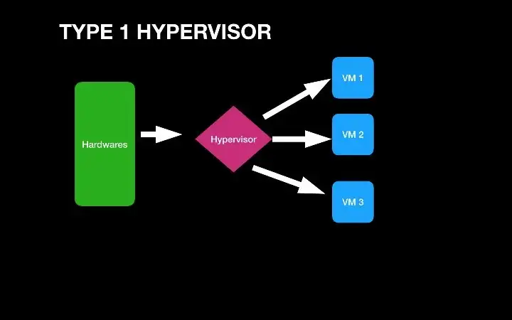
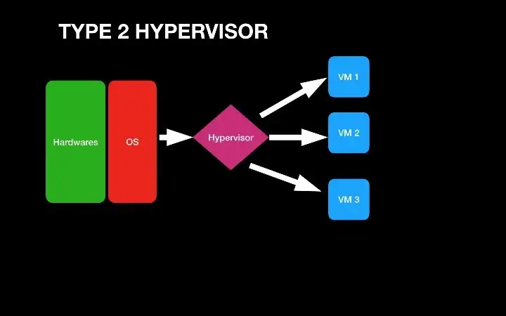
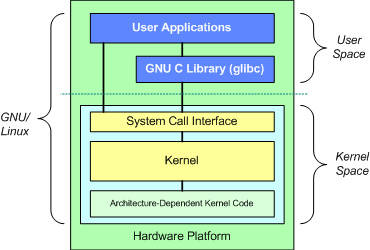
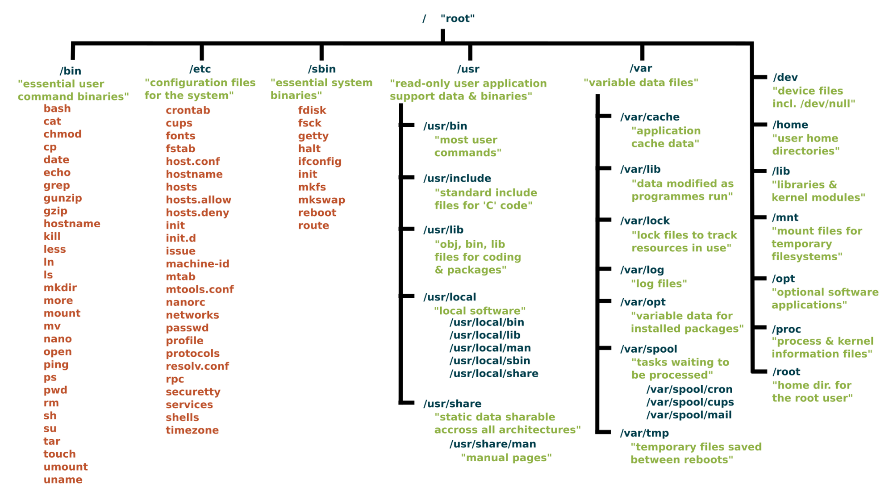
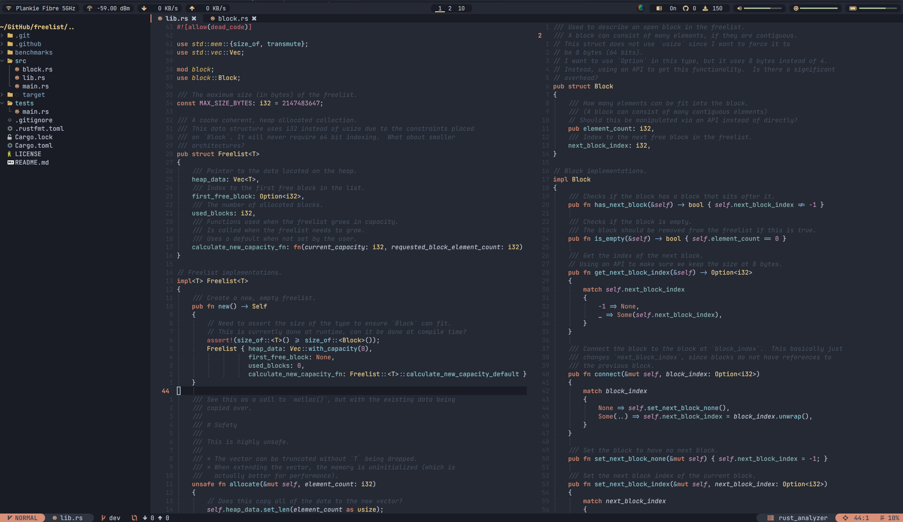
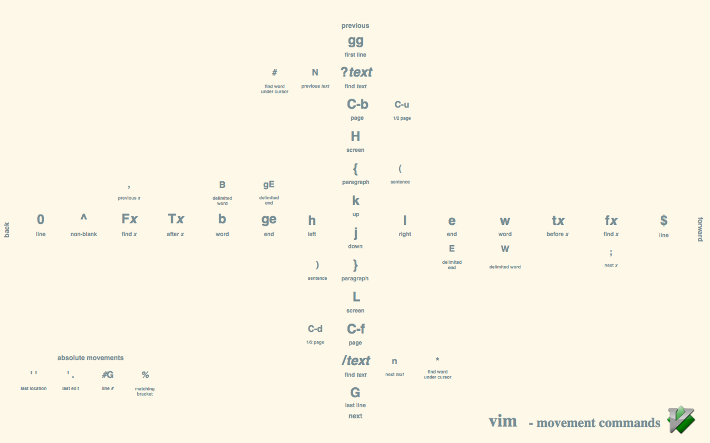

# Week 1

## Learning Outcomes and Topics
This week:
- Introductions
- Course Outline
- What is Linux
- Set up a Linux VM
	- Overview of some of the tools that we will be using this term

Next week:
- Review of several commands used to navigate and find things in the command line
	- ls
	- cd
	- pwd
	- grep
	- find
- Getting help in the command line
	- using manules with the `man` utility
	- using `help` for bash builtins


## Introductions

**About me**
- I started using a Linux distribution in the late 90s, [Slackware](http://www.slackware.com/)  
- Most of my professional work has involved a Linux operating system.  
	- I have primarily worked in System Administration and DevOps fields.  
- In my free time I like to try out new Linux distros and other open source software.  
- Over the years I have contributed to a number of open source projects.  
- I also enjoy some of the usual nerdy things:  
	- Sci-Fi  
	- Comics  
- When I am not doing something related to the above I am probably climbing  

**About You**
- Do you have a favorite programming language or tool or technology related to the program?  
	- If so what is it and why?  
- Do you have any previous experience using a Linux OS or a BSD OS? (other than 1420)  
- On a scale of 1 - 10 how comfortable are you working in the command line?  
- Outside of your school work what do you like to do? What is a primary hobby of yours?   

## Course Outline


**Evaluation Criteria**

| Criteria | % | Comments |
|----------|---|----------|
| Quizzes | 10 | |
| Labs | 20 | |
| Assignments | 20 | 2x 10% each |
| Midterm Exam | 25 | |
| Final Exam | 25 | |

**Office Hours**

Tuesday   11:30-12:30  
Thursday  09:00-10:00  
Friday    09:00-10:00  
==Please schedule at least 24 hours in advance via email or discord==

**Course Notes**

Course notes are distributed as plain text Markdown files.

The intention is that you will clone the repo and every week do a `git pull` to get the current week's notes. Once you have the notes, open them up and add your own notes to them as you work through the material.

If you are unfamiliar with Markdown, it is a simple markup language (think simplified HTML).  
You can write Markdown in any plain text editor (vim, vscode...) or one of the many note-taking apps that use Markdown. A lot of apps that you are already using probably use Markdown. For example, Notion and discord both use Markdown. 

Markdown is also used for a lot of technical documentation, most of the README files you have seen on GitHub are written in Markdown. 

[Markdown syntax cheat sheet](https://www.markdownguide.org/cheat-sheet/)

**Late Submissions**

Late submissions will be accepted up until 4 days.  
10% will be deducted per day.  
The first day begins the moment you are late. ie if an assignment is due at 23:30 and you submit at 23:31 you are a day late.

The entire course outline is available [here](https://www.bcit.ca/outlines/20231089212/)

## Some of the tools that we will be using this term

### VirtualBox 
[VirtualBox](https://www.virtualbox.org/) is a relatively easy to use virtual machine manager that is available for Linux, MacOS and Windows.

### Vagrant
[Vagrant](https://www.vagrantup.com/) Is a tool that can be used to create VM configuration in plain text files.
This means that you save your setup for a VM in a text file on GitLab for example and you can quickly recreate a new VM using this file.

### Ubuntu
[Ubuntu](https://ubuntu.com/) is a popular Linux distro used on servers, and desktops.  
Ubuntu comes in two official versions:  
- LTS 22.04  
- 22.10  

Generally, you would use the LTS(long term support) version for production work. Since we aren't going to be creating anything for production, we are going to use the slightly newer 22.10 version.

### Windows Terminal
[Windows Terminal](https://github.com/microsoft/terminal) is already installed if you are using Windows 11. In Windows 10, you can install it from the Microsoft store.
[A video intro to Windows Terminal](https://www.youtube.com/watch?v=2dsnwlnNBzs)

This is obviously only for people using Windows. If you are using BSD, Linux or MacOS you probably already have a decent terminal emulator.

### WSL
[WSL](https://learn.microsoft.com/en-us/windows/wsl/about) Windows Subsystem for Linux is a tool that you can use to run a Linux environment from within Windows. This is a popular tool for developers who use Windows because it gives them easy access to a Linux development environment.

### DigitalOcean
[DigitalOcean](https://www.digitalocean.com/) DigitalOcean is a cloud service provider. We will be using this near the end of the term, so we will come back to it then.

## Before we get started, some useful terminology

**open source**

open source software is software that provides the source code which can be freely used, shared and modified.

Do You think open source software is less secure than closed source software?  
What is your reason for thinking that?

About 90% of most applications are built on open source code.
[Video on 2022 open source stats](https://www.youtube.com/watch?v=g0LYPJitubc)

[open source](https://opensource.org/licenses)

**Free software**

Although Free and open source are not the same thing, they are often related, and are very much related in the context of Linux based operating systems.

> Thus, “free software” is a matter of liberty, not price. To understand the concept, you should think of “free” as in “free speech,” not as in “free beer”.
> [GNU philosophy](https://www.gnu.org/philosophy/free-sw.html)

**System administration, SRE(site reliability engineer) and DevOps**

In as broad a definition as is possible, a system administrator is someone who configures and keeps computer systems running.

A site reliability engineer is someone who works in operations and solves operations problems as if they were software problems.

> DevOps is a modern way to deliver higher quality applications faster - by automating the software delivery lifecycle, and by giving development and operations teams more shared responsibility and more input into each other’s work.

> Like SRE, DevOps makes a business more agile by balancing the need to deliver more applications and changes faster with the need to avoid 'breaking' the production environment. And like SRE, DevOps aims to achieve this balance by establishing an acceptable risk of errors. In fact, SRE and DevOps seem so similar that some experts say they're the same thing - but most see SRE practices as excellent ways to implement DevOps principles. 
> [IBM](https://www.ibm.com/cloud/learn/site-reliability-engineering)

## Virtualization review

> Software called [hypervisors](https://www.redhat.com/en/topics/virtualization/what-is-a-hypervisor) separate the physical resources from the virtual environments—the things that need those resources. Hypervisors can sit on top of an operating system (like on a laptop) or be installed directly onto hardware (like a server), which is how most enterprises virtualize. Hypervisors take your physical resources and divide them up so that virtual environments can use them.  
> Red Hat, What is virtualization


- Is VirtualBox an example of a type 1 or type 2 hypervisor?
- What are some reasons that an individual or organization might use a VM?





[Red Hat, What is virtualization](https://www.redhat.com/en/topics/virtualization/what-is-virtualization)

[Short Video on Virtualization](https://www.youtube.com/watch?v=FZR0rG3HKIk)

## What is Linux

- What is Linux?
- What is a Linux distro?
- Who is using Linux and what are they using it for?
	- Why are these people using Linux?
- Who created Linux?
	- Who is maintaining it now?


**The Linux Kernel**




The kernel has 4 jobs:

1.  **Memory management:** Keep track of how much memory is used to store what, and where
2.  **Process management:** Determine which processes can use the central processing unit (CPU), when, and for how long
3.  **Device drivers:** Act as mediator/interpreter between the hardware and processes
4.  **System calls and security:** Receive requests for service from the processes

**Distros that I use regularly**

[Fedora Silverblue](https://silverblue.fedoraproject.org/)

[openSuse MicroOS](https://microos.opensuse.org/) (I am using this right now)

[Alpine Linux](https://www.alpinelinux.org/)

[OpenBSD](https://www.openbsd.org/) (not Linux, but closer to Linux than MacOS or Windows)

[Red Hat What is the Linux kernel](https://www.redhat.com/en/topics/linux/what-is-the-linux-kernel)  
[IBM, The Linux kernel](https://developer.ibm.com/articles/l-linux-kernel/)


## Reading

Readings should be completed before the start of next weeks class.

Most of the readings will be available on O'Reilly learning. You have access to this through BCIT. In the past, students have used this before in other classes and know how to access readings here. If this is not the case, let me know and I will add instructions here.

This week's readings come from *A Practical Guide to Linux Commands, Editors, and Shell Programming*, Fourth Edition, by Mark Sobell and Matthew Helmke

Chapter 2, *Getting Started*
- [Working from the Command Line](https://learning.oreilly.com/library/view/a-practical-guide/9780134774626/ch02.xhtml#ch02lev1sec4)  
- [`man`: Displays the System Manual](https://learning.oreilly.com/library/view/a-practical-guide/9780134774626/ch02.xhtml#ch02lev2sec5)  

Chapter 3, *The Utilities*
- [Basic Utilities](https://learning.oreilly.com/library/view/a-practical-guide/9780134774626/ch03.xhtml#ch03lev1sec3)  
- [`less` Is `more`: Display a Text File One Screen at a Time](https://learning.oreilly.com/library/view/a-practical-guide/9780134774626/ch03.xhtml#ch03lev1sec4)  
- [Working with Files](https://learning.oreilly.com/library/view/a-practical-guide/9780134774626/ch03.xhtml#ch03lev2sec6)  
## Readings from Week 1
###   
#### Working from the Command Line

Before the introduction of the graphical user interface, UNIX and then Linux provided only a textual (command-line) interface. Today, a textual interface is available when you log in from a terminal, a terminal emulator, or a textual virtual console, or when you use ssh or telnet to log in on a system.

Advantages of the textual interface

Although the concept might seem antiquated, the textual interface has a place in modern computing. In some cases an administrator might use a command-line tool either because a graphical equivalent does not exist or because the graphical tool is not as powerful or flexible as the textual one. For example, chmod ([pages 102](https://learning.oreilly.com/library/view/a-practical-guide/9780134774626/ch04.xhtml#page_102) and [759](https://learning.oreilly.com/library/view/a-practical-guide/9780134774626/ch18.xhtml#page_759)) is more powerful and flexible than its GUI counterpart. Frequently, on a server system, a graphical interface might not even be installed. The first reason for this omission is that a GUI consumes a lot of system resources; on a server, those resources are better dedicated to the main task of the server. Additionally, security considerations mandate that a server system run as few tasks as possible because each additional task can make the system more vulnerable to attack.

You can also write scripts using the textual interface. Using scripts, you can easily reproduce tasks on multiple systems, enabling you to scale the tasks to larger environments. When you are the administrator of only a single system, using a GUI is often the easiest way to configure the system. When you act as administrator for many systems, all of which need the same configuration installed or updated, a script can make the task go more quickly. Writing a script using command-line tools is frequently easy, whereas the same task can be difficult to impossible using graphical tools.

Pseudographical interface

Before the introduction of GUIs, resourceful programmers created textual interfaces that included graphical elements such as boxes, borders outlining rudimentary windows, highlights, and, more recently, color. These textual interfaces, called pseudographical interfaces, bridge the gap between textual and graphical interfaces. The Midnight Commander file management utility (mc; page [902](https://learning.oreilly.com/library/view/a-practical-guide/9780134774626/ch18c.xhtml#page_902)) is a good example of a utility with a well-designed pseudographical interface

#### Which Shell Are You Running?

This book discusses both the Bourne Again Shell (bash) and the TC Shell (tcsh). You are probably running bash, but you might be running tcsh or another shell such as the Z Shell (zsh). When you enter  ```echo $0```  and press ```RETURN``` in response to a shell prompt (usually **$** or **%**), the shell displays the name of the shell you are working with. This command works because the shell expands **$0** to the name of the program you are running (page [470](https://learning.oreilly.com/library/view/a-practical-guide/9780134774626/ch10.xhtml#page_470)). This command might display output like this:

```
$ **echo $0**
-bash
```

Or the local system might display output like this:
```
$ echo $0
/bin/bash
```

Either way, this output shows you are running ```
bash```. If you are running a different shell, the shell will display appropriate output.

#### Correcting Mistakes

This section explains how to correct typographical and other errors you might make while you are logged in on a textual display. Because the shell and most other utilities do not interpret the command line or other text you enter until you press RETURN, you can readily correct a typing mistake before you press RETURN.

You can correct such mistakes in several ways: Erase one character at a time, back up a word at a time, or back up to the beginning of the line in one step. After you press RETURN, it is too late to correct a mistake: At that point, you must either wait for the command to run to completion or abort execution of the program (next page).

##### Erasing a Character

While entering characters from the keyboard, you can back up and erase a mistake by pressing the _erase key_ once for each character you want to delete. The erase key backs over as many characters as you wish. It does not, in general, back up past the beginning of the line.

The default erase key is BACKSPACE. If this key does not work, try pressing DEL or CONTROL-H. If these keys do not work, give the following stty[2](https://learning.oreilly.com/library/view/a-practical-guide/9780134774626/ch02.xhtml#fn2_2) command to set the erase and line kill (see “Deleting a Line”) keys to their default values:

```
$ **stty ek**
```

[2](https://learning.oreilly.com/library/view/a-practical-guide/9780134774626/ch02.xhtml#fn2_2a). The command stty is an abbreviation for _set teletypewriter,_ the first terminal UNIX ran on. Today stty is commonly thought of as meaning _set terminal._

Alternatively, you can give the next command to reset most terminal parameters to a sane value. If the RETURN key does not move the cursor to the next line, press CONTROL-J instead.

```
$ **stty sane**
```

See page [989](https://learning.oreilly.com/library/view/a-practical-guide/9780134774626/ch18d.xhtml#page_989) for more examples of using stty.

##### Deleting a Word

You can delete a word you entered by pressing CONTROL-W. A _word_ is any sequence of characters that does not contain a SPACE or TAB. When you press CONTROL-W, the cursor moves left to the beginning of the current word (as you are entering a word) or the previous word (when you have just entered a SPACE or TAB), removing the word.

---

Tip: CONTROL-Z **suspends a program**

Although it is not a way of correcting a mistake, you might press the suspend key (typically CONTROL-Z) by mistake and wonder what happened. If you see a message containing the word **Stopped**, you have just stopped your job using job control (page [151](https://learning.oreilly.com/library/view/a-practical-guide/9780134774626/ch05.xhtml#page_151)). If you give the command **fg** to continue your job in the foreground, you should return to where you were before you pressed the suspend key. For more information refer to “bg: Sends a Job to the Background” on page [306](https://learning.oreilly.com/library/view/a-practical-guide/9780134774626/ch08.xhtml#page_306).

---

##### Deleting a Line

Any time before you press RETURN, you can delete the line you are entering by pressing the (_line_) _kill key._ When you press this key, the cursor moves to the left, erasing characters as it goes, back to the beginning of the line. The default line kill key is CONTROL-U. If this key does not work, try CONTROL-X. If these keys do not work, give the stty command described under “Erasing a Character.”

##### Aborting Execution

Sometimes you might want to terminate a running program. For example, you might want to stop a program that is performing a lengthy task such as displaying the contents of a file that is several hundred pages long or copying a large file that is not the one you meant to copy.

To terminate a program from a textual display, press the _interrupt key_ (CONTROL-C or sometimes DELETE or DEL). When you press this key, the Linux operating system sends a TERM (termination) signal to the program you are running and to the shell. Exactly what effect this signal has depends on the program. Some programs stop execution immediately, some ignore the signal, and some take other actions. When the shell receives a TERM signal, it displays a prompt and waits for another command.

If these methods do not terminate the program, try sending the program a QUIT signal (CONTROL-\). If all else fails, try pressing the suspend key (typically CONTROL-Z), giving a **jobs** command to verify the number of the job running the program, and using kill to abort the job. The job number is the number within the brackets at the left end of the line displayed by **jobs** (**[1]**). In the next example, the **kill** command ([pages 152](https://learning.oreilly.com/library/view/a-practical-guide/9780134774626/ch05.xhtml#page_152) and [866](https://learning.oreilly.com/library/view/a-practical-guide/9780134774626/ch18c.xhtml#page_866)) uses **–TERM** to send a TERM signal to the job specified by the job number, which is preceded by a percent sign (**%1**). You can omit **–TERM** from the command, as kill sends a TERM signal by default. [Table 10-5](https://learning.oreilly.com/library/view/a-practical-guide/9780134774626/ch10b.xhtml#tab10_5) on page [496](https://learning.oreilly.com/library/view/a-practical-guide/9780134774626/ch10b.xhtml#page_496) lists some signals.

---

Caution: Use the KILL signal as a last resort

When the termination signal does not work, use the KILL signal (specify **–KILL** in place of **–TERM** in the example). A running program cannot ignore a KILL signal; it is sure to abort the program.

Because a program receiving a KILL signal has no chance to clean up its open files before being terminated, using KILL can corrupt application data. Use the KILL signal as a last resort. Before using KILL, give a termination (TERM) or quit (QUIT) signal a full ten seconds to take effect.

---

[Click here to view code image](https://learning.oreilly.com/library/view/a-practical-guide/9780134774626/ch02a.xhtml#pp0031_01a)

```
$ **bigjob**
^Z
[1]+  Stopped                 bigjob
$ **jobs**
[1]+  Stopped                 bigjob
$ **kill -TERM %1**
[1]+  Killed                  bigjob
```

The **kill** command returns a prompt; you might need to press RETURN again to see the confirmation message. For more information refer to “Running a Command in the Background” on page [150](https://learning.oreilly.com/library/view/a-practical-guide/9780134774626/ch05.xhtml#page_150).

#### Repeating/Editing Command Lines

To repeat a previous command, press the UP ARROW key. Each time you press this key, the shell displays an earlier command line. Press the DOWN ARROW key to browse through the command lines in the other direction. To reexecute the displayed command line, press RETURN.

The RIGHT ARROW and LEFT ARROW keys move the cursor back and forth along the displayed command line. At any point along the command line, you can add characters by typing them. Use the erase key (page [29](https://learning.oreilly.com/library/view/a-practical-guide/9780134774626/ch02.xhtml#page_29)) to remove characters from the command line. Press RETURN to execute the modified command.

You can also repeat the previous command using **!!**. This technique is useful if you forgot to use su (next page) to prefix a command. In this case, if you type **su –c "!!"**, the shell will run the previous command with **root** privileges. Or, if the local system is set up to use sudo (next page), you can type **sudo !!** and the shell will run the previous command with **root** privileges.

The command **^old^new^** reruns the previous command, substituting the first occur-rence of the string **old** with **new**. Also, on a command line, the shell replaces the characters **!$** with the last token (word) on the previous command line. The following example shows the user correcting the filename **meno** to **memo** using **^n^m^** and then printing the file named **memo** by giving the command **lpr !$**. The shell replaces **!$** with **memo**, the last token on the previous command line.

[Click here to view code image](https://learning.oreilly.com/library/view/a-practical-guide/9780134774626/ch02a.xhtml#pp0031_02a)


```
$ cat meno
cat: meno: No such file or directory
$ ^n^m
cat memo
This is the memo file.
$ lpr !$
lpr memo
```

For information about more complex command-line editing, see page [338](https://learning.oreilly.com/library/view/a-practical-guide/9780134774626/ch08b.xhtml#page_338)

#### man: Displays the System Manual

The textual man (manual) utility displays (man) pages from the system documentation. This documentation is helpful when you know which utility you want to use but have forgotten exactly how to use it. You can also refer to the man pages to get more information about specific topics or to determine which features are available with Linux. Because the descriptions in the system documentation are often terse, they are most helpful if you already understand the basic

To find out more about a utility, give the command **man**, followed by the name of the utility. [Figure 2-1](https://learning.oreilly.com/library/view/a-practical-guide/9780134774626/ch02.xhtml#fig2_1) shows man displaying information about itself; the user entered a **man man** command.

less (pager)

The man utility sends its output through a _pager_—usually less (page [53](https://learning.oreilly.com/library/view/a-practical-guide/9780134774626/ch03.xhtml#page_53)), which displays one screen of information at a time. When you display a manual page using man, less displays a prompt [e.g., **Manual page man(1) line 1**] at the bottom of the screen after it displays each screen of text and waits for you to take one of the following steps:

• Press the SPACE bar to display another screen of text.

• Press PAGE UP, PAGE DOWN, UP ARROW, or DOWN ARROW to navigate the text.

• Press **h** (help) to display a list of less commands.

• Press **q** (quit) to stop less and cause the shell to display a prompt.

You can search for topics covered by man pages using the apropos utility (next page).

Manual sections

Based on the FHS (Filesystem Hierarchy Standard; page [98](https://learning.oreilly.com/library/view/a-practical-guide/9780134774626/ch04.xhtml#page_98)), the Linux system manual and the man pages are divided into ten sections, where each section describes related tools:

1.   User Commands

2.   System Calls

3.   Subroutines

4.   Devices

5.   File Formats

6.   Games

7.   Miscellaneous

8.   System Administration

9.   Kernel

10. New


**Figure 2-1** The man utility displaying information about itself

This layout closely mimics the way the set of UNIX manuals has always been divided. Unless you specify a manual section, man displays the earliest occurrence in the manual of the word you specify on the command line. Most users find the information they need in sections 1, 6, and 7; programmers and system administrators frequently need to consult the other sections.

In some cases the manual contains entries for different tools with the same name. For example, the following command displays the man page for the passwd utility from section 1 of the system manual:

$ **man passwd**

To see the man page for the **passwd** file from section 5, enter this command:

$ **man 5 passwd**

The preceding command instructs man to look only in section 5 for the man page. In documentation you might see this man page referred to as **passwd(5)**. Use the **–a** option (see the adjacent tip) to view all man pages for a given subject (press **q**RETURN to display each subsequent man page). For example, give the command **man –a passwd** to view all man pages for **passwd**.

---

Tip: Options

An option modifies the way a utility works. Options are usually specified as one or more letters that are preceded by one or two hyphens. An option typically appears following the name of the utility you are calling and a SPACE. Other _arguments_ (page [1083](https://learning.oreilly.com/library/view/a-practical-guide/9780134774626/gloss.xhtml#page_1083)) to the command follow the option and a SPACE. For more information refer to “Options” on page [131](https://learning.oreilly.com/library/view/a-practical-guide/9780134774626/ch05.xhtml#page_131).

---
### Basic Utilities

One of the advantages of Linux is that it comes with thousands of utilities that perform myriad functions. You will use utilities whenever you work with Linux, whether you use them directly by name from the command line or indirectly from a menu or icon. The following sections discuss some of the most basic and important utilities; these utilities are available from a CLI. Some of the more important utilities are also available from a GUI; others are available only from a GUI.

---

Tip: Run these utilities from a command line

This chapter describes command-line, or textual, utilities. You can experiment with these utilities from a terminal, a terminal emulator within a GUI, or a virtual console.

---

Folder/directory

The term _directory_ is used extensively in the next sections. A directory is a resource that can hold files. On other operating systems, including Windows and macOS, and frequently when speaking about a Linux GUI, a directory is referred to as a _folder._ That is a good analogy: A traditional manila folder holds files just as a directory does.

---

Tip: In this chapter you work in your home directory

When you log in on the system, you are working in your _home directory._ In this chapter that is the only directory you use: All the files you create in this chapter are in your home directory. [Chapter 4](https://learning.oreilly.com/library/view/a-practical-guide/9780134774626/ch04.xhtml#ch04) goes into more detail about directories.

---

#### ls: Lists the Names of Files

Using the editor of your choice, create a small file named **practice**. (A tutorial on the vim editor appears on page [167](https://learning.oreilly.com/library/view/a-practical-guide/9780134774626/ch06.xhtml#page_167) and a tutorial on emacs appears on page [224](https://learning.oreilly.com/library/view/a-practical-guide/9780134774626/ch07.xhtml#page_224).) After exiting from the editor, you can use the ls (list) utility to display a list of the names of the files in your home directory. In the first command in [Figure 3-1](https://learning.oreilly.com/library/view/a-practical-guide/9780134774626/ch03.xhtml#fig3_1), ls lists the name of the **practice** file. (You might also see files that the system or a program created automatically.) Subsequent commands in [Figure 3-1](https://learning.oreilly.com/library/view/a-practical-guide/9780134774626/ch03.xhtml#fig3_1) display the contents of the file and remove the file. These commands are described next.

#### cat: Displays a Text File

The cat utility displays the contents of a text file. The name of the command is derived from _catenate,_ which means to join together, one after the other. ([Figure 5-8](https://learning.oreilly.com/library/view/a-practical-guide/9780134774626/ch05.xhtml#fig5_8) on page [141](https://learning.oreilly.com/library/view/a-practical-guide/9780134774626/ch05.xhtml#page_141) shows how to use cat to string together the contents of three files.)

A convenient way to display the contents of a file on the screen is by giving the command **cat**, followed by a SPACE and the name of the file. [Figure 3-1](https://learning.oreilly.com/library/view/a-practical-guide/9780134774626/ch03.xhtml#fig3_1) shows cat displaying the contents of **practice**. This figure shows the difference between the ls and cat utilities: The ls utility displays the _name_ of a file, whereas cat displays the _contents_ of a file.

#### rm: Deletes a File

The rm (remove) utility deletes a file. [Figure 3-1](https://learning.oreilly.com/library/view/a-practical-guide/9780134774626/ch03.xhtml#fig3_1) shows rm deleting the file named **practice**. After rm deletes the file, ls and cat show that **practice** is no longer in the directory.

---

Tip: A safer way of removing files

You can use the interactive form of rm to make sure you delete only the file(s) you intend to delete. When you follow rm with the **–i** option (see page [35](https://learning.oreilly.com/library/view/a-practical-guide/9780134774626/ch02.xhtml#page_35) for a tip on options) and the name of the file you want to delete, rm prompts you with the name of the file and waits for you to respond with **y** (yes) before it deletes the file. It does not delete the file if you respond with a string that begins with a character other than **y**. Under some distributions, the **–i** option is set up by default for the **root** user:

```
$ rm -i toollist
rm: remove regular file 'toollist'? y
```

**Optional:** You can create an alias (page [352](https://learning.oreilly.com/library/view/a-practical-guide/9780134774626/ch08b.xhtml#page_352)) for **rm –i** and put it in your startup file (page [89](https://learning.oreilly.com/library/view/a-practical-guide/9780134774626/ch04.xhtml#page_89)) so rm always runs in interactive mode.

---


**Figure 3-1** Using ls, cat, and rm on the file named **practice**

The ls utility does not list its filename, and cat says that no such file exists. Use rm carefully. Refer to page [953](https://learning.oreilly.com/library/view/a-practical-guide/9780134774626/ch18d.xhtml#page_953) or give the command **info coreutils 'rm invocation'** for more information. If you are running macOS, see “Many Utilities Do Not Respect Apple Human Interface Guidelines” on page [1076](https://learning.oreilly.com/library/view/a-practical-guide/9780134774626/appd.xhtml#page_1076).

#### less Is more: Display a Text File One Screen at a Time

Pagers

When you want to view a file that is longer than one screen, you can use either the less utility or the more utility. Each of these utilities pauses after displaying a screen of text; press the SPACE bar to display the next screen of text. Because these utilities show one page at a time, they are called _pagers._ Although less and more are very similar, they have subtle differences. At the end of the file, for example, less displays an **END** mes-sage and waits for you to press **q** before returning you to the shell. In contrast, more returns you directly to the shell. While using both utilities you can press **h** to display a Help screen that lists commands you can use while paging through a file. Give the commands **less practice** and **more practice** in place of the **cat** command in [Figure 3-1](https://learning.oreilly.com/library/view/a-practical-guide/9780134774626/ch03.xhtml#fig3_1) to see how these commands work. Use the command **less /etc/services** instead if you want to experiment with a longer file. Refer to page [873](https://learning.oreilly.com/library/view/a-practical-guide/9780134774626/ch18c.xhtml#page_873) for more information on less.

#### hostname: Displays the System Name

The hostname utility displays the name of the system you are working on. Use this utility if you are not sure that you are logged in on the correct machine.

```
$ hostname
guava
```


### Working with Files

This section describes utilities that copy, move, print, search through, display, sort, compare, and identify files. If you are running macOS, see “Resource forks” on page [1071](https://learning.oreilly.com/library/view/a-practical-guide/9780134774626/appd.xhtml#page_1071).

---

Tip: Filename completion

After you enter one or more letters of a filename (following a command) on a command line, press `TAB`, and the shell will complete as much of the filename as it can. When only one filename starts with the characters you entered, the shell completes the filename and places a SPACE after it. You can keep typing or you can press RETURN to execute the command at this point. When the characters you entered do not uniquely identify a filename, the shell completes what it can and waits for more input. If pressing TAB does not change the display, press TAB again (bash; page [348](https://learning.oreilly.com/library/view/a-practical-guide/9780134774626/ch08b.xhtml#page_348)) or CONTROL-D (tcsh; “Word Completion” on page [391](https://learning.oreilly.com/library/view/a-practical-guide/9780134774626/ch09.xhtml#page_391)) to display a list of possible completions.

---

#### cp: Copies a File

The cp (copy) utility ([Figure 3-2](https://learning.oreilly.com/library/view/a-practical-guide/9780134774626/ch03.xhtml#fig3_2), next page) makes a copy of a file. This utility can copy any file, including text and executable program (binary) files. You can use cp to make a backup copy of a file or a copy to experiment with.

The cp command line uses the following syntax to specify source and destination files:

_cp **source-file destination-file**_

The _**source-file**_ is the name of the file that cp will copy. The _**destination-file**_ is the name cp assigns to the resulting (new) copy of the file.

The cp command line in [Figure 3-2](https://learning.oreilly.com/library/view/a-practical-guide/9780134774626/ch03.xhtml#fig3_2) copies the file named **memo** to **memo.copy**. The period is part of the filename—just another character. The initial ls command shows that **memo** is the only file in the directory. After the cp command, a second ls shows two files in the directory, **memo** and **memo.copy**.

Sometimes it is useful to incorporate the date into the name of a copy of a file. The following example includes the date January 30 (**0130**) in the copied file:

```
$ cp memo memo.0130
```
Although it has no significance to Linux, including the date in this way can help you find a version of a file you created on a certain date. Including the date can also help you avoid overwriting existing files by providing a unique filename each day. For more information refer to “Filenames” on page [86](https://learning.oreilly.com/library/view/a-practical-guide/9780134774626/ch04.xhtml#page_86).

Use scp (page [713](https://learning.oreilly.com/library/view/a-practical-guide/9780134774626/ch17.xhtml#page_713)) or ftp (page [838](https://learning.oreilly.com/library/view/a-practical-guide/9780134774626/ch18b.xhtml#page_838)) when you need to copy a file from one system to another on a network.

---

Caution: cp **can destroy a file**

If the _**destination-file**_ exists _before_ you give a cp command, cp overwrites it. Because cp over-writes (and destroys the contents of) an existing _**destination-file**_ without warning, you must take care not to cause cp to overwrite a file that you need. The cp **–i** (interactive) option prompts you before it overwrites a file. See page [35](https://learning.oreilly.com/library/view/a-practical-guide/9780134774626/ch02.xhtml#page_35) for a tip on options.

The following example assumes the file named **orange.2** exists before you give the cp command. The user answers **y** to overwrite the file.

[Click here to view code image](https://learning.oreilly.com/library/view/a-practical-guide/9780134774626/ch03a.xhtml#pp0054_01a)
```
$ cp –i orange orange.2
cp: overwrite 'orange.2'? y
```

---

#### mv: Changes the Name of a File

The mv (move) utility can rename a file without making a copy of it. The mv command line specifies an existing file and a new filename using the same syntax as cp:


**Figure 3-2** mv renames a file

_**mv existing-filename new-filename**_

The command line in [Figure 3-2](https://learning.oreilly.com/library/view/a-practical-guide/9780134774626/ch03.xhtml#fig3_2) changes the name of the file **memo** to **memo.0130**. The initial ls command shows that **memo** is the only file in the directory. After you give the mv command, **memo.0130** is the only file in the directory. Compare this result to that of the cp example in [Figure 3-2](https://learning.oreilly.com/library/view/a-practical-guide/9780134774626/ch03.xhtml#fig3_2).

The mv utility can be used for more than changing the name of a file; refer to “mv, cp: Move or Copy Files” on page [97](https://learning.oreilly.com/library/view/a-practical-guide/9780134774626/ch04.xhtml#page_97) and to the mv info page.

---

Caution: mv **can destroy a file**

Just as cp can destroy a file, so can mv. Also like cp, mv has a **–i** (interactive) option. See the caution box labeled “cp can destroy a file.”

---

#### lpr: Prints a File

The lpr (line printer) utility places one or more files in a print queue for printing. Linux provides print queues so only one job is printed on a given printer at a time. A queue allows several people or jobs to send output simultaneously to a single printer with the expected results. For systems that have access to more than one printer, you can use **lpstat –p** to display a list of available printers. Use the **–P** option to instruct lpr to place the file in the queue for a specific printer—even one that is connected to another system on the network. The following command prints the file named **report**:

```
$ lpr report
```

Because this command does not specify a printer, the output goes to the default printer, which is _the_ printer when you have only one printer.

The next command line prints the same file on the printer named **mailroom**:

```
$ lpr -P mailroom report
```

You can send more than one file to the printer with a single command. The following command line prints three files on the printer named **laser1**:

[Click here to view code image](https://learning.oreilly.com/library/view/a-practical-guide/9780134774626/ch03a.xhtml#pp0055_01a)

```
$ lpr -P laser1 05.txt 108.txt 12.txt
```


**Figure 3-3** cp copies a file

lpq

You can see which jobs are in the print queue by giving an **lpstat –o** command or by using the lpq utility:

[Click here to view code image](https://learning.oreilly.com/library/view/a-practical-guide/9780134774626/ch03a.xhtml#pp0056_01a)

```
$ lpq
lp is ready and printing
Rank  Owner   Job Files               Total Size
active max     86 (standard input)      954061 bytes
```

lprm

In this example, Max has one job that is being printed; no other jobs are in the queue. You can use the job number (86 in this case) with the lprm utility to remove the job from the print queue and stop it from printing:

```
$ lprm 86
```
#### grep: Searches for a String

The grep[1](https://learning.oreilly.com/library/view/a-practical-guide/9780134774626/ch03.xhtml#fn3_1) utility searches through one or more files to see whether any contain a specified string of characters. This utility does not change the file it searches but simply displays each line that contains the string.

The grep command in [Figure 3-4](https://learning.oreilly.com/library/view/a-practical-guide/9780134774626/ch03.xhtml#fig3_4) searches through the **memo** file for lines that contain the string **credit** and displays the single line that meets this criterion. If **memo** contained such words as **discredit**, **creditor**, or **accreditation**, grep would have displayed those lines as well because they contain the string it was searching for. The **–w** (words) option causes grep to match only whole words. Although you do not need to enclose the string you are searching for in single quotation marks, doing so allows you to put SPACEs and special characters in the search string.


**Figure 3-4** grep searches for a string

[1](https://learning.oreilly.com/library/view/a-practical-guide/9780134774626/ch03.xhtml#fn3_1a). Originally the name grep was a play on an ed (an original UNIX editor, available on most distributions) command: **g/re/p**. In this command **g** stands for global, **re** is a regular expression delimited by slashes, and **p** means print.

The grep utility can do much more than search for a simple string in a single file. Refer to page [853](https://learning.oreilly.com/library/view/a-practical-guide/9780134774626/ch18b.xhtml#page_853) and Appendix A for more information.

#### head: Displays the Beginning of a File

By default the head utility displays the first ten lines of a file. You can use head to help you remember what a particular file contains. For example, if you have a file named **months** that lists the 12 months of the year in calendar order, one to a line, then head displays **Jan** through **Oct** ([Figure 3-5](https://learning.oreilly.com/library/view/a-practical-guide/9780134774626/ch03.xhtml#fig3_5)).

This utility can display any number of lines, so you can use it to look at only the first line of a file, at a full screen, or even more. To specify the number of lines displayed, include a hyphen followed by the number of lines you want head to display. For example, the following command displays only the first line of **months**:

```
$ head -1 months
Jan
```

The head utility can also display parts of a file based on a count of blocks or characters rather than lines. Refer to page [861](https://learning.oreilly.com/library/view/a-practical-guide/9780134774626/ch18b.xhtml#page_861) for more information on head.

#### tail: Displays the End of a File


**Figure 3-5** head displays the first ten lines of a file

The tail utility is similar to head but by default displays the _last_ ten lines of a file. Depending on how you invoke it, this utility can display fewer or more than ten lines. Alternatively, you can use a count of blocks or characters rather than lines to display parts of a file. The tail command in [Figure 3-5](https://learning.oreilly.com/library/view/a-practical-guide/9780134774626/ch03.xhtml#fig3_5) displays the last five lines (**Aug** through **Dec**) of the **months** file.

You can monitor lines as they are added to the end of the growing file named **logfile** by using the following command:

```
$ tail -f logfile
```
Press the interrupt key (usually CONTROL-C) to stop tail and display the shell prompt. Refer to page [992](https://learning.oreilly.com/library/view/a-practical-guide/9780134774626/ch18d.xhtml#page_992) for more information on tail.

#### sort: Displays a File in Order

The sort utility displays the contents of a file in order by lines; it does not change the original file.

[Figure 3-6](https://learning.oreilly.com/library/view/a-practical-guide/9780134774626/ch03.xhtml#fig3_6) shows cat displaying the file named **days**, which contains the name of each day of the week on a separate line in calendar order. The sort utility then displays the file in alphabetical order.

The sort utility is useful for putting lists in order. The **–u** option generates a sorted list in which each line is unique (no duplicates). The **–n** option puts a list of numbers in numerical order. Refer to page [969](https://learning.oreilly.com/library/view/a-practical-guide/9780134774626/ch18d.xhtml#page_969) for more information on sort.

#### uniq: Removes Duplicate Lines from a File

The uniq (unique) utility displays a file, skipping adjacent duplicate lines; it does not change the original file. If a file contains a list of names and has two successive entries for the same person, uniq skips the extra line ([Figure 3-7](https://learning.oreilly.com/library/view/a-practical-guide/9780134774626/ch03.xhtml#fig3_7)).


**Figure 3-6** sort displays the lines of a file in order

If a file is sorted before it is processed by uniq, this utility ensures that no two lines in the file are the same. (Of course, sort can do that all by itself with the **–u** option.) Refer to page [1023](https://learning.oreilly.com/library/view/a-practical-guide/9780134774626/ch18d.xhtml#page_1023) for more information on uniq.

#### diff: Compares Two Files

The diff (difference) utility compares two files and displays a list of the differences between them. This utility does not change either file; it is useful when you want to compare two versions of a letter or a report, or two versions of the source code for a program.

The diff utility with the **–u** (unified output format) option first displays two lines indicating which of the files you are comparing will be denoted by a plus sign (**+**) and which by a minus sign (**–**). In [Figure 3-8](https://learning.oreilly.com/library/view/a-practical-guide/9780134774626/ch03.xhtml#fig3_8), a minus sign indicates the **colors.1** file; a plus sign indicates the **colors.2** file.


**Figure 3-7** uniq removes duplicate lines


**Figure 3-8** diff displaying the unified output format

The **diff –u** command breaks long, multiline text into _hunks._ Each hunk is preceded by a line starting and ending with two at signs (**@@**). This hunk identifier indicates the starting line number and the number of lines from each file for this hunk. In [Figure 3-8](https://learning.oreilly.com/library/view/a-practical-guide/9780134774626/ch03.xhtml#fig3_8), the hunk covers the section of the **colors.1** file (indicated by a minus sign) from the first line through the sixth line. The **+1,5** then indicates the hunk covers **colors.2** from the first line through the fifth line.

Following these header lines, **diff –u** displays each line of text with a leading minus sign, a leading plus sign, or a SPACE. A leading minus sign indicates the line occurs only in the file denoted by the minus sign. A leading plus sign indicates the line occurs only in the file denoted by the plus sign. A line that begins with a SPACE (neither a plus sign nor a minus sign) occurs in both files in the same location. Refer to page [795](https://learning.oreilly.com/library/view/a-practical-guide/9780134774626/ch18.xhtml#page_795) for more information on diff.

#### file: Identifies the Contents of a File

You can use the file utility to learn about the contents of any file on a Linux system without having to open and examine the file yourself. In the following example, file reports that **letter_e.bz2** contains data that was compressed using the bzip2 utility (page [64](https://learning.oreilly.com/library/view/a-practical-guide/9780134774626/ch03.xhtml#page_64)):

[Click here to view code image](https://learning.oreilly.com/library/view/a-practical-guide/9780134774626/ch03a.xhtml#pp0060_01a)

```
$ file letter_e.bz2
letter_e.bz2: bzip2 compressed data, block size = 900k
```

Next, file reports on two more files:

[Click here to view code image](https://learning.oreilly.com/library/view/a-practical-guide/9780134774626/ch03a.xhtml#pp0060_02a)

```
$ file memo zach.jpg
memo:     ASCII text
zach.jpg: JPEG image data, ... resolution (DPI), 72 x 72
```

Refer to page [820](https://learning.oreilly.com/library/view/a-practical-guide/9780134774626/ch18b.xhtml#page_820) for more information on file.

### | (Pipeline): Communicates Between Processes

Because pipelines are integral to the functioning of a Linux system, this chapter introduces them for use in examples. Pipelines are covered in detail beginning on page [145](https://learning.oreilly.com/library/view/a-practical-guide/9780134774626/ch05.xhtml#page_145). Pipelines do not work with macOS resource forks; they work with data forks only.

A _pipeline_ (denoted by a pipe symbol that is written as a vertical bar [**|**] on the command line and appears as a solid or broken vertical line on a keyboard) takes the output of one utility and sends that output as input to another utility. More accurately, a pipeline takes standard output of one process and redirects it to become standard input of another process. See page [137](https://learning.oreilly.com/library/view/a-practical-guide/9780134774626/ch05.xhtml#page_137) for more information on standard output and standard input.

Some utilities, such as head, can accept input from a file named on the command line or, via a pipeline, from standard input. In the following command line, sort processes the **months** file ([Figure 3-5](https://learning.oreilly.com/library/view/a-practical-guide/9780134774626/ch03.xhtml#fig3_5), page [57](https://learning.oreilly.com/library/view/a-practical-guide/9780134774626/ch03.xhtml#page_57)); using a pipeline, the shell sends the output from sort to the input of head, which displays the first four months of the sorted list:

```
$ sort months | head -4
Apr
Aug
Dec
Feb
```
wc

The next command line displays the number of files in a directory. The wc (word count) utility with the **–w** (words) option displays the number of words in its standard input or in a file you specify on the command line:

```
$ **ls | wc -w**
14
```

You can also use a pipeline to send output of a program to the printer:

```
$ **tail months | lpr**
```


# Week 2 

## Learning Outcomes and Topics

This week:
- explain reasons why you want(need) to use the command line in 2023
- explain how commands are executed in a shell
- learn to use a few commands that will help you navigate in a command line environment
  - cd
  - pwd
  - ls
- learn how to use the `man` utility
- learn how to read man pages
  

Next week:
- The Linux file system
- Finding files with `find` and `grep`
- command line text editors:
  - vi(m)
  - nano
  - helix

## Why are we still using the command line?

The reading from last week (everyone did the reading, right) provides a few good reasons to use the command line in 2023.

- Servers, and other minimal Linux configurations, where a GUI is:
  - unnecessary
  - adds complexity and might introduce additional vulnerability

Personally, I think the best reason to use the command line still is that it is really powerful. 
When you get even a little more comfortable with the command line you will find that you are able to achieve a lot of tasks faster than in a GUI.

One reason for this is that commands are a programming language. 
The shell is a REPL. It is possible to combine commands that generate data, with commands that filter data.

For example, man pages(more them later). 
If I wanted to search for a man page that allows me to change a user's password I could use `man -k password`. 
The information is in there, but it is a lot of data to sort through. So I add a filter with `grep` `man -k password | grep change`. 
This command returns a lot less data. Now I can open the man page, read how to use `passwd` and change a user's password.
All from the same tool!

Working in a text based interface can be tricky at first, and it takes practice. However, it is totally worth it. So stick to it.

## Getting around in the command line

Everyone probably knows the `cd` command. An interesting note about `cd` is that it is a shell built-in. 
Unlike `grep` which is a separate utility, `cd` is actually part of bash. 
You can find out about other shell built-ins with `help` if you want to see help for `cd` `help cd`.

`cd` is change directory, we can use it to change the location we are running commands in. 

*What does `cd ..` do?*

**`ls`**

The `ls` utility lists the contents of your current working directory.

On Linux OSs, and Mac and Windows, "hidden" files are created by starting the file name with a '.'. 
For example ".bashrc". Generally these are hidden so that an average computer user doesn't do anything to them. 
They are generally used to configure software and services on your device. 

You can see the hidden files with `ls -a`.

In addition to showing you a list of files, `ls` can also show you information about those files. 
`ls -l` "-l" is "long listing". This shows you file permissions, ownership, the date the file was last edited and the files size. 
You can combine l and a `ls -ahl`. *What do you think -h does? How could you find out?* 

```
-rw-r--r-- 1 riversng river 1150 Sep 26 19:51 filename
|[-][-][-]-  [------] [---]
| |  |  | |     |       |
| |  |  | |     |       +------------> 7. Group
| |  |  | |     +--------------------> 6. Owner
| |  |  | +--------------------------> 5. Alternate Access Method
| |  |  +----------------------------> 4. Others Permissions
| |  +-------------------------------> 3. Group Permissions
| +----------------------------------> 2. Owner Permissions
+------------------------------------> 1. File Type
```

**Your prompt**

Most of the time when you connect to a remote server, or open a terminal from a desktop you will be in the home directory of the user you are logged in as.

You will likely see something that looks a little like this`username@hostname ~$` (this will be slightly different depending on the operating system that you are using. This little string is your shells prompt. The shells prompt usually provides you with some handy information. 

`username` is your user name, the user who is currently running commands in the shell. You can change users in the shell.

`hostname` the hostname of the machine you are connected to. 

The tilde character `~` is shorthand for the users home directory `~ = /home/vagrant` this is the directory where commands will be run. So if you run the command `mkdir week2` you will be creating a new directory in `/home/vagrant` 

The `$` is commonly used to represent a regular user, but it has no special functionality, some shells use a `%` as the default prompt character.

The `#` is likewise often used to represent root.

The information in your prompt is configurable, you can change it to provide more or less information. We will look at some basic configuration later on.

`pwd` this will print the name of the current working directory, where you are in your file path.

**Important**

“Your home” directory and “the home” directory are not the same thing.

Your home refers to `/home/user-name` 

The home directory is just `/home` this is where all of the users home directories are. Unless you are creating or removing a user you generally don’t run any commands from `/home` 


## A few special characters

We are going to see a lot of "special characters" in the command line. I might start a list in your notes.

The pipe character `|` will "pipe" output from one command into another command. Like filtering the man page search above.

The double ampersand `&&` `sudo apt update && sudo apt upgrade`. 
This command is actually two commands, the second will run only if the first succeeds. If the first returns an error the second command won't run.

`mkdir` this will make a directory `mkdir new-dir` `mkdir -p new-dir/other-new-dir`. *What do you think the second command does?*

## Options, or Flags

These are additional (optional) information that we can pass to a command. 
Some options take arguments, others do not. Options that don't take arguments can be written like this `ls -alh`

## Practice tips

In addition to just trying to use the command line more (try not using your file finder for a day.), try incorporating two new things to your command line skill set every week. 
This week, try these two things:
1. Use tab more to complete commands
2. Try using ctrl + u(delete command entered so far) and ctrl + w(delete a word) instead of backspace when you make a typo.

[keyboard shortcuts](https://www.computerhope.com/ushort.htm)

[Red Hat 10 terminal shortcuts for Linux](https://www.redhat.com/sysadmin/top-10-shortcuts)

## Getting help in the command line.

Earlier you saw `help` however the main tool used to learn more about commands is `man`. Short for manual.

### Pagers

When you open a man page you are opening the manual entry in a pager, `less`. 
A pager, shows you a page of info at a time.
- To find out how to use less press `h`
- To quit press `q`

### reading a man page

| Bold | type this exactly, this is often the command |
| --- | --- |
| [OPTION] | options or flags, ie -a |
| italic or underlined | Replace with appropriate argument |
| -a | -b | Options separated by pipe cannot be used together |
| … | Arguments followed by an ellipses can be repeated |
| <mandatory> | Mandatory argument, usually found in option descriptions |
| {yes, no} | Limited options, only those specified will work |

**Headings of a man page**

Not all of these headings will be in every man page

- **Name:** The name of the command the man page is describing.
- **Synopsis:** A summary of the command and its syntax.
- **Configuration:** Configuration details for a device.
- **Description:** An explanation of what the program does.
- **Options:** A description of the command-line options the command accepts.
- **Exit Status:** Possible exit status values for the command, and what might cause them to be used.
- **Return Value:** If the man page is for a library
routine, this describes the value the library routine can send back to
the function that called that routine.
- **Errors:** A list of the values that might be placed in `errno` [in the event of an error](http://man7.org/linux/man-pages/man3/errno.3.html).
- **Environment:** A list of the environment variables that affect the command or program, and in what way.
- **Files:** A list of the files the command or program uses, such as configuration files.
- **Attributes:** A summary of various attributes of the command.
- **Versions:** Details of the Linux kernel or library
versions where a system call or library function first appeared or
changed significantly from previous versions.
- **Conforming to:** A description of any standards with which the command might comply, such as [POSIX](https://en.wikipedia.org/wiki/POSIX).
- **Notes:** Miscellaneous notes.
- **Bugs:** Known issues.
- **Examples:** One or more examples demonstrating the use of the command.
- **Authors:** The people who wrote or maintain the command.
- **See also:** Recommended reading related to the command or topic.

**Additional Resources**  

[Arch wiki man page](https://wiki.archlinux.org/title/Man_page)

**Bookmark this tool** [explain shell](https://explainshell.com/https://explainshell.com/)
 

## Reading

**Reading Questions**
## - How would you describe the Filesystem Hierarchy Standard? 
	- https://refspecs.linuxfoundation.org/FHS_3.0/fhs/index.html
## Common Filesystem Layouts

Once you have a filesystem in place, an obvious challenge is to come up with a way to organize its content. You may want to organize things like where programs are stored, configuration data, system data, and user data. We will refer to this organization of directories and their content as the _filesystem layout_. Formally, the layout is called the [Filesystem Hierarchy Standard (FHS)](https://oreil.ly/q0c4a). It defines directories, including their structure and recommended content. The Linux Foundation maintains the FHS, and it’s a good starting point for Linux distributions to follow.

The idea behind FHS is laudable. However, in practice you will find that the filesystem layout very much depends on the Linux distribution you’re using. Thus, I strongly recommend you use the `man hier` command to learn about your concrete setup.

To provide you with a high-level idea of what you can expect when you see certain top-level directories, I compiled a list of common ones in [Table 5-3](https://learning.oreilly.com/library/view/learning-modern-linux/9781098108939/ch05.html#tab-fslayouts).

Table 5-3. Common top-level directories

| Directory | Semantics |
| ---------- | ------------ |
|_bin_, _sbin_ | System programs and commands (usually links to _/usr/bin_ and _/usr/sbin_)|
| _boot_ | Kernel images and related components |
| _dev_ | Devices (terminals, drives, etc.) |
| _etc_ | System configuration files |
|_home_ | User home directories |
| _lib_ | Shared system libraries|
|_mnt_, _media_|Mount points for removable media (e.g., USB sticks)|
|_opt_| Distro specific; can host package manager files|
|_proc_, _sys_ | Kernel interfaces; see also [“Pseudo Filesystems”](https://learning.oreilly.com/library/view/learning-modern-linux/9781098108939/ch05.html#pseudo-fs)|
|_tmp_|For temporary files|
|_usr_|User programs (usually read-only)|
|_var_|User programs (logs, backups, network caches, etc.)|

With that, let’s move on to some special kinds of filesystems.


## - What is a Pseudo Filesystem
## Pseudo Filesystems

Filesystems are a great way to structure and access information. By now you have likely already internalized the Linux motto that “everything is a file.” We looked at how Linux provides a uniform interface via VFS in [“The Virtual File System”](https://learning.oreilly.com/library/view/learning-modern-linux/9781098108939/ch05.html#vfs). Now, let’s take a closer look at how an interface is provided in cases where the VFS implementor is not a block device (such as an SD card or an SSD drive).

Meet pseudo filesystems: they only pretend to be filesystems so that we can interact with them in the usual manner (`ls`, `cd`, `cat`), but really they are wrapping some kernel interface. The interface can be a range of things, including the following:

-   Information about a process
    
-   An interaction with devices such as keyboards
    
-   Utilities such as special devices you can use as data sources or sinks
    

Let’s have a closer look at the three major pseudo filesystems Linux has, starting with the oldest.

### procfs

Linux inherited the [_/proc_](https://oreil.ly/QEdmm) filesystem (`procfs`) from UNIX. The original intention was to publish process-related information from the kernel, to make it consumable for system commands such as `ps` or `free`. It has very few rules around structure, allows read-write access, and over time many things found their way into it. In general, you find two types of information there:

-   Per-process information in _/proc/PID/_. This is process-relevant information that the kernel exposes via directories with the PID as the directory name. Details concerning the information available there are listed in [Table 5-4](https://learning.oreilly.com/library/view/learning-modern-linux/9781098108939/ch05.html#tab-procfsprocess).
    
-   Other information such as mounts, networking-related information, TTY drivers, memory information, system version, and uptime.
    

You can glean per-process information as listed in [Table 5-4](https://learning.oreilly.com/library/view/learning-modern-linux/9781098108939/ch05.html#tab-procfsprocess) simply by using commands like `cat`. Note that most are read-only; the write semantics depend on the underlying resource.

Table 5-4. Per-process information in procfs (most notable)

|Entry|Type|Information|
|---|---|---|
|`attr`|Directory|Security attributes|
|`cgroup`|File|Control groups|
|`cmdline`|File|Command line|
|`cwd`|Link|Current working directory|
|`environ`|File|Environment variables|
|`exe`|Link|Executable of the process|
|`fd`|Directory|File descriptors|
|`io`|File|Storage I/O (bytes/char read and written)|
|`limits`|File|Resource limits|
|`mem`|File|Memory used|
|`mounts`|File|Mounts used|
|`net`|Directory|Network stats|
|`stat`|File|Process status|
|`syscall`|File|Syscall usage|
|`task`|Directory|Per-task (thread) information|
|`timers`|File|Timers information|
To see this in action, let’s inspect the process status. We’re using `status` here rather than `stat`, which doesn’t come with human-readable labels:

```
$ cat /proc/self/status | head -10 [![1]
Name: cat
Umask: 0002
State: R (running) [![2]
Tgid: 12011
Ngid: 0
Pid: 12011 [![3]
PPid: 3421 [![4]
TracerPid:     0
Uid:     1000     1000     1000     1000
Gid:     1000     1000     1000     1000

```

[](https://learning.oreilly.com/library/view/learning-modern-linux/9781098108939/ch05.html#co_filesystems_CO8-1)

Get the process status about the currently running command, showing only the first 10 lines.

[](https://learning.oreilly.com/library/view/learning-modern-linux/9781098108939/ch05.html#co_filesystems_CO8-2)

The current state (running, on-CPU).

[](https://learning.oreilly.com/library/view/learning-modern-linux/9781098108939/ch05.html#co_filesystems_CO8-3)

The PID of the current process.

[](https://learning.oreilly.com/library/view/learning-modern-linux/9781098108939/ch05.html#co_filesystems_CO8-4)

The process ID of the parent process of the command; in this case, it’s the shell where I ran the `cat` command in.

Here is one more example of using `procfs` to glean information, this time from the networking space:

$ cat /proc/self/net/arp
IP address       HW `type`     Flags       HW address            Mask     Device
`192`.168.178.1    0x1         0x2         3c:a6:2f:8e:66:b3     *        wlp1s0
`192`.168.178.37   0x1         0x2         dc:54:d7:ef:90:9e     *        wlp1s0

As shown in the previous command, we can glean ARP information about the current process from this special _/proc/self/net/arp_.

`procfs` is very useful if you’re [low-level debugging](https://oreil.ly/nJ01w) or developing system tooling. It is relatively messy, so you’ll need the kernel docs or, even better, the kernel source code at hand to understand what each file represents and how to interpret the information in it.

Let’s move on to a more recent, more orderly way the kernel exposes information.

## sysfs

Where `procfs` is pretty Wild West, the [_/sys_](https://oreil.ly/EHJEJ) filesystem (`sysfs`) is a Linux-specific, structured way for the kernel to expose select information (such as about devices) using a standardized layout.

Here are the directories in `sysfs`:

_block/_

This directory symbolic links to discovered block devices.

_bus/_

In this directory, you find one subdirectory for each physical bus type supported in the kernel.

_class/_

This directory contains device classes.

_dev/_

This directory contains two subdirectories: _block/_ for block devices and _char/_ for character devices on the system, structured with `major-ID:minor-ID`.

_devices/_

In this directory, the kernel provides a representation of the device tree.

_firmware/_

Via these directories, you can manage firmware-specific attributes.

_fs/_

This directory contains subdirectories for some filesystems.

_module/_

In these directories you find subdirectories for each module loaded in the kernel.

There are more subdirectories in `sysfs`, but some are newish and/or would benefit from better documentation. You’ll find certain information duplicated in `sysfs` that is also available in `procfs`, but other information (such as memory information) is only available in `procfs`.

Let’s see `sysfs` in action (output edited to fit):

```
$
```

[](https://learning.oreilly.com/library/view/learning-modern-linux/9781098108939/ch05.html#co_filesystems_CO9-1)

List information about block device `sda`, showing only the first seven lines.

[](https://learning.oreilly.com/library/view/learning-modern-linux/9781098108939/ch05.html#co_filesystems_CO9-2)

The `backing_dev_info` link using `MAJOR:MINOR` format.

[](https://learning.oreilly.com/library/view/learning-modern-linux/9781098108939/ch05.html#co_filesystems_CO9-3)

Captures device [capabilities](https://oreil.ly/GFUid), such as if it is removable.

[](https://learning.oreilly.com/library/view/learning-modern-linux/9781098108939/ch05.html#co_filesystems_CO9-4)

Contains the device major and minor number (`8:0`); see also the [block device drivers reference](https://oreil.ly/DK9GT) for what the numbers mean.

Next up in our little pseudo filesystem review are devices.

## devfs

The [_/dev_](https://oreil.ly/EkO8V) filesystem (`devfs`) hosts device special files, representing devices ranging from physical devices to things like a random number generator or a write-only data sink.

The devices available and managed via `devfs` are:

_Block devices_

Handle data in blocks—for example, storage devices (drives)

_Character devices_
Handle things character by character, such as a terminal, a keyboard, or a mouse

_Special devices_

Generate data or allow you to manipulate it, including the famous _/dev/null_ or _/dev/random_

Let’s now see `devfs` in action. For example, assume you want to get a random string. You could do something like the following:

```
tr -dc A-Za-z0-9 < /dev/urandom | head -c 42
```

The previous command generates a 42-character random sequence containing uppercase and lowercase as well as numerical characters. And while _/dev/urandom_ looks like a file and can be used like one, it indeed is a special file that, using a number of sources, generates (more or less) random output.

What do you think about the following command:

```
echo "something" > /dev/tty
```

That’s right! The string “something” appeared on your display, and that is by design. _/dev/tty_ stands for the terminal, and with that command we sent something (quite literally) to it.

With a good understanding of filesystems and their features, let’s now turn our attention to filesystems that you want to use to manage regular files such as documents and data files.


- What is the difference between /usr/bin and /bin
	- _bin_, _sbin_ -> System programs and commands (usually links to _/usr/bin_ and _/usr/sbin_)
	-   `/bin` : For binaries usable before the `/usr` partition is mounted. This is used for trivial binaries used in the very early boot stage or ones that you need to have available in booting single-user mode. Think of binaries like `cat`, `ls`, etc.
	-   `/sbin` : Same, but for binaries with _superuser (root) privileges required_.
	-   `/usr/bin` : Same as first, but for _general system-wide binaries_.
	-   `/usr/sbin` : Same as above, but for binaries with superuser (root) privileges required.
- Where are system level configuration files
	- `/etc` directory
- How do open a new file in Vim
	When you want to open a new file in a directory, give a new filename with the `vi` command. For example, if you want to open a new file called _practice_ in the current directory, you would enter:
	```$ vi practice```

	Since this is a new file, the buffer is empty, and the screen appears as follows:
	```
	~
	~
	~
	"practice" [New file]
	```
	
	The tildes (~) down the lefthand column of the screen indicate that there is no text in the file, not even blank lines. The prompt line (also called the status line) at the bottom of the screen echoes the name and status of the file.
	
	You can also edit any existing text file in a directory by specifying its filename. Suppose that there is a Unix file with the pathname _/home/john/letter_. If you are already in the _/home/john_ directory, use the relative pathname. For example:
	
	```
	$ vi letter
	```
	
	brings a copy of the file _letter_ to the screen.
	
	If you are in another directory, give the full pathname to begin editing:
	
	```
	$ vi /home/john/letter
	```
- How do you save a file in Vim
- ## Saving and Quitting a File

You can quit working on a file at any time, save your edits, and return to the command prompt (if you’re running inside a terminal window). The command to quit and save edits is `ZZ`. Note that `ZZ` is capitalized.

Let’s assume that you do create a file called _practice_ to practice `vi` commands, and that you type in six lines of text. To save the file, first check that you are in command mode by pressing ESC, and then enter `ZZ`:

|Keystrokes|Results|
|---|---|
|`ZZ`|`"practice" [New] 6L, 104C written`|
|     |Give the write and save command, `ZZ`. Your file is saved as a regular disk file.|
|`$ ls` | `ch01.asciidoc ch02.asciidoc practice`|
|     |Listing the files in the directory shows the new file _practice_ that you created.|

You can also save your edits with `ex` commands. Type `:w` to save (write) your file but not quit; type `:q` to quit if you haven’t made any edits; and type `:wq` to both save your edits and quit. (`:wq` is equivalent to `ZZ`.) We’ll explain fully how to use `ex` commands in [Chapter 5](https://learning.oreilly.com/library/view/learning-the-vi/9781492078791/ch05.html#vi8-ch-5); for now, you should just memorize a few commands for writing and saving files.

- How do you search for a file in Vim
	- use the forward slash `/`
	- There is also a group of commands that echo on the bottom line of the screen. Bottom-line commands are preceded by different symbols. The slash (`/`) and the question mark (`?`) begin search commands and are discussed in [Chapter 3, “Moving Around in a Hurry”](https://learning.oreilly.com/library/view/learning-the-vi/9781492078791/ch03.html#vi8-ch-3). A colon (`:`) begins all `ex` commands. `ex` commands are those used by the `ex` line editor. The `ex` editor is available to you when you use any version of `vi`, because `ex` is the underlying editor and `vi` is really just its “visual” mode. `ex` commands and concepts are discussed fully in [Chapter 5, “Introducing the ex Editor”](https://learning.oreilly.com/library/view/learning-the-vi/9781492078791/ch05.html#vi8-ch-5), but this chapter introduces you to the `ex` commands to quit a file without saving edits.

[Learning Modern Linux Ch 5. Filesystems](https://learning.oreilly.com/library/view/learning-modern-linux/9781098108939/ch05.html)

[Learning vi and Vim editors, 8th ED, Ch 1. Introducing vi and Vim](https://learning.oreilly.com/library/view/learning-the-vi/9781492078791/ch01.html)


# Week 3

## Learning Outcomes and Topics

This week:

- Filesystem Hierarchy Standard
- Describe how most Linux directories are structured
- Use `lsblk` and `tree` to learn more about filesystems
- Use vi(m) to edit several files
- Introduction to `find` and `grep` to find files

Next week:

- Permissions and Ownership
- Users and Groups

## Utilities

Last week, we looked at a few utilities to help move around on the filesystem. This week we are going to look at tools to help learn more about the filesystem, tools to find files and tools to edit files. Most of these tools are already installed. The `tree` utility can be installed with the following command. `sudo apt install tree` In a later class, we will talk more about sudo and apt.
DigitalOcean note: When you are the root user you don’t need to use sudo.

## Filesystems

In general, when people talk about a filesystem they might be talking about 2 different, but very closely related things.

A file system or filesystem such as ext4 or btrfs is the underlying data structure used to separate and organize files on your system. There are a number of different types of filesystem, ext4 is a journalling filesystem, btrfs is a copy-on-write filesystem for example. Most of the time, a person using a computer doesn’t need to worry about which filesystem their machine is using (often more than one). 

The command `lsblk --exclude 7 -f` can be used to see how partitions on your Linux machine are formatted, which filesystem they use.

When you are installing a Linux OS, unless you have a good reason to change the filesystem, I recommend installing what the developers have setup as the default.

Resources:

[File systems](https://wiki.archlinux.org/title/File_systems)

[Btrfs](https://wiki.archlinux.org/title/Btrfs)

[Ext4](https://wiki.archlinux.org/title/Ext4)

## Filesystem Hierarchy Standard

The Filesystem Hierarchy Standard, or FHS is a good starting place, although not strictly adhered to. Different Linux distros will differ slightly in where certain things are stored.

[Filesystem Hierarchy Standard](https://refspecs.linuxfoundation.org/FHS_3.0/fhs/index.html)

Are there any directories that contain the same content? 
Why do you think that is?

As we progress through the class you will have more opportunity to explore some of these directories.

When I was learning to use Linux I would cd into a directory and try to find out what some the things inside that directory did.
Don't worry about breaking things, it is just a VM, and most "important" stuff you can't change without sudo.



There’s a man page for this too 😯 `man hier`

The `tree` utility is a little like `ls`,only it shows youthe contents of a directory, as well as subdirectories in a tree. Tree is great for exploring how files are organized.

The `tree` command will print a lot material.

We can narrow down the output with the `-d` and `-L` options. Try this `tree -dL 1`

You can also combine `tree` with `less` and a pipe, like this `tree -dL 2 | less`.

Note on terms:

- I sometimes use command, when I am talking about using a utility, running a command.
- And a utility when I am refering to the program itself.

**Pseudo Filesystems**

Last week I said “In Linux, everything is a file”. An interesting example of this is the `/proc` directory.

The `/proc` directory contains processes and kernel information files.
`/proc` makes use of the virtual file system to allow a user to interact with this data in the same way that you would what we more traditionally think of as a file. For example you can cat the uptime file to see how long your system has been up. 

## Finding Files with `grep` and `find`

`grep` and `find` are utilities that you will use a lot, you have already seen `grep` used to help narrow down the number of items returned when searching for a man page with `man`

Both `grep` and `find` can be used to help you; find files. `grep` searches the content of files, what is in the files and `find` searches for files by name, type, size…


^ carrot for start
for anything *
[Red Hat 10 ways to use the Linux find command](https://learning.oreilly.com/library/view/learning-modern-linux/9781098108939/ch04.html)

[Red Hat How to use grep](https://www.redhat.com/sysadmin/how-to-use-grep)

## Command Linux Text Editors



Last week, we talked about a couple of reasons that we are still using the command line. Two of those reasons were: Servers don’t need a GUI and the fact that the command line can be really powerful and fast. Command line editors are an extension of both of these.

Sometimes you need to make small edits to a file on a server. You could edit the file locally, copy it to the server, delete the original… You can already see that this won’t always be the most efficient way to work. If you just need to change a line of text, open the file in a command line editor and edit the file.

Some of the things we talked about last week in terms of power and speed are relative, too. Many of the tools that we use on the command line are so great, because they are small, simple tools that can be combined to perform more complex tasks. A text editor is no different. 

## Why Vim

Why should you learn vi and Vim:

1. Vim is everywhere, from servers to key bindings in most other editors.
2. It's scalable. You can use it just to edit config files or it can become your entire writing and coding platform.
3. It's powerful.

Number 1 is the reason that we are interested in vi(m) today. vi really is everywhere, so it is a good idea to know the basics.

### vi, Vim and Neovim

[Vim](https://www.vim.org/)

[Neovim](https://neovim.io/)

### Modal Editing

What is a modal text editor?

The short answer is that it is an editor with different modes 🤔

Each mode has a specific purpose. That is to say, you would switch to that mode to perform certain tasks. 

Why is normal/command mode the default?

How would you describe a modal text editor to someone new to vim?

**vi modes:**
  - **command** mode (this is normal mode in vim)
  - **insert** mode

**vim modes:**

  - **normal** mode (this is the mode that you start vim in by default) escape
    use normal mode for many edits, removing text, changing indentation...
  - **insert** mode (this is basically the only mode other poor vscode has (unless you have the vim
    plugin for vscode)) i
  - **visual** mode use visual mode to make visual selections v
    - visual line mode, select one line at a time shift + v
    - visual block mode, select in blocks ctrl + v

  - **replace** mode replace text. replace mode is like insert but will write over existing text
      with the new character R

  - **command** mode allows you to enter commands that start with a : as well as run shell
    commands `:! mkdir new_dir` will create a new directory in your current working directory
    command mode can also be used for things like search and replace  

Just the basics

What other tool have we used in class with some of the same keybindings?

Provide an example of a keybinding that both tools share?


Vim commands

| Vim Command | Description |
| --- | --- |
| i | Enter Insert mode |
| Esc | Return to Normal mode from other modes  |
| x or Del | Delete a character |
| X | Delete character is backspace mode |
| u | Undo changes |
| Ctrl + r | Redo changes |
| yy | Copy a line |
| dd | Delete a line |
| p | Paste the content of the buffer |
| /<search_term> | Search and then cycle through matches with n and N |
| 
| [ [ or gg | Move to the beginning of a file ^|
| ]] or G | Move to the end of a file |
| :%s/foo/bar/gci | Search and replace all occurrences with confirmation |
| Esc + :w | Save changes |
| Esc + :wq or Esc + ZZ | Save and quit Vim |
| Esc + :q! | Force quit Vim discarding all changes |

## Getting help

Yes, there is a man page for vim `man vim` however vim also has builtin help.
You can access vim's builtin help with `:help`

You can access a specific section in the docs with `:help topic` ie `:help yank` will open documentation on copying in vim.

`:help` will open a split window above your current window. This is just another buffer so you can navigate through it with vim keys you can close it with `:bd` buffer delete.
You can move to a different split with Ctrl+w Arrow-keys for example `ctrl + w down-arrow` will take you to a split below the split you are currently in.

## Movements

How would you move to the top of a document?
How about to the bottom of a document?

One of the promises of Vim is that if you put in the time to learn Vim, you will be able to edit code faster.
I believe this is true (I also don't think you need to use Vim to be a good software developer)
One of the ways that Vim will speed up your workflow is a combination of editing commands and movements.

You already know that `h = left, l = right, j = down and k = up`

But this is just the beginning.

Some of these movements can also be combined with numbers. For example what do you think `2j` will do?

A more extensive Vim cheat sheet

[Vim Cheat Sheet](https://vim.rtorr.com/)



## vim commands are composable

Can you think of a more complex example than 2j? What does it do?

Believe it or not, this simple little `2j` example is an incredibly powerful feature of vim.

Commands in Vim are composable. They form a simple language, and you can combine commands to make more complex commands. Vim commands are a programming interface 🤯

`4dd` and `4dj` will delete the current line and the following 3 lines.

### Verbs

Verbs are the actions we take, and they can be performed on nouns. Here are some examples:

- **`d`**: delete
- **`c`**: change
- **`y`**: yank (copy)
- **`v`**: visually select

### Modifiers

Modifiers are used before nouns to describe the way in which you're going to do something. Some examples:

- **`i`**: inside
- **`a`**: around
- **`NUM`**: number (e.g.: 1, 2, 10)
- **`t`**: searches for something and stops before it
- **`f`**: searches for that thing and lands on it
- **`/`**: find a string (literal or regex)

### Nouns

In English, nouns are objects you do something *to*. With Vim, it's the same. Here are some Vim nouns:

- **`w`**: word
- **`s`**: sentence
- **`)`**: sentence (another way of doing it)
- **`p`**: paragraph
- **`}`**: paragraph (another way of doing it)
- **`t`**: tag (think HTML/XML)
- **`b`**: block (think programming)

From [https://danielmiessler.com/study/vim/#files](https://danielmiessler.com/study/vim/#files)

## finding text

Which key would you use to find the character on a line before another character?

To search for a word in your file, use `/` forward or `?` backward

to move to the next occurrence of a character, use `f` for find ie `fa` will move to the next “a” on a line (if there is an a)

There is also a `:find` command, this is used to find files for editing by their name.

### Some other modal text editors

- **[Helix](https://helix-editor.com/)** This is the editor that I use in class.
- **[Kakoune](http://kakoune.org/)**


```
" Comments in Vimscript start with a `"`.

" create a new file ~/.vimrc and copy this code block into it.
" you can create the file by entering the command 'vim ~/.vimrc'

" Vim is based on Vi. Setting `nocompatible` switches from the default
" Vi-compatibility mode and enables useful Vim functionality.
set nocompatible

" Turn on syntax highlighting.
syntax on

" Disable the default Vim startup message.
set shortmess+=I

" Show line numbers.
set number

" This enables relative line numbering mode.
" with relative and regular the current line will show the actual line number
set relativenumber

" Always show the status line at the bottom, even if you only have one window open.
set laststatus=2

" use the system clipboard instead of buffer
" depending on the distro you may need to install gvim, or vim-gtk to get this feature
" you can check that you have a version of vim capable of this by running this command 'vim --version | grep clipboard'
" if you see +clipboard it will work, if not it won't.
set clipboard=unnamedplus

" The backspace key has slightly unintuitive behavior by default. For example,
" by default, you can't backspace before the insertion point set with 'i'.
" This configuration makes backspace behave more reasonably, in that you can
" backspace over anything.
set backspace=indent,eol,start

" replace tabs with spaces
set expandtab
" 1 tab = 2 spaces
set tabstop=2 shiftwidth=2

" By default, Vim doesn't let you hide a buffer (i.e. have a buffer that isn't
" shown in any window) that has unsaved changes. This is to prevent you from "
" forgetting about unsaved changes and then quitting e.g. via `:qa!`. I find
" hidden buffers helpful enough to disable this protection. See `:help hidden`
" for more information on this.
set hidden

" Do not save backup files. and swap files
" This might save you a lot of headache later.
" If you quit vim incorrectly it leaves a swap file, 
" like a backup of unsaved changes. This is a good thing, but more often than
" not these swapfiles cause problems for peopel new to vim.
set nobackup
set noswapfile

" alternatively you could save them in a different location, 
" just uncomment the lines  below and comment out the nobackup and noswapfile above 
"set backupdir=~/.vim/backup//
"set directory=~/.vim/swap//
"set undodir=~/.vim/undo//

" This setting makes search case-insensitive when all characters in the string
" being searched are lowercase. However, the search becomes case-sensitive if
" it contains any capital letters. This makes searching more convenient.
set ignorecase
set smartcase

" search
set hlsearch     " Highlight all search results
set incsearch    " Searches for strings incrementally

" Use the mouse, you actually usually don't want this.
" You are better off learning to use Vim without using the mouse
" You will be faster and more productive without it.
" If you really want to use the mouse uncomment the line below.
"set mouse=a

" enable wildmenu, a little menu that displays files and commands in the button left corner
set wildmenu
set wildmode=list:longest,full

" Unbind some useless/annoying default key bindings.
nmap Q <Nop> " 'Q' in normal mode enters Ex mode. You almost never want this.

" Disable audible bell because it's annoying.
set noerrorbells visualbell t_vb=

" Try to prevent bad habits like using the arrow keys for movement. 
nnoremap <Left>  :echo "Use h"<CR>
nnoremap <Right> :echo "Use l"<CR>
nnoremap <Up>    :echo "Use k"<CR>
nnoremap <Down>  :echo "Use j"<CR>
```


## Reading 

**Reading Questions**
- How do change a files permissions
	- using the utility `chmod`

| Pattern            | Effective permission | Decimal representation |
|--------------------|----------------------|-------------------------|
| "---"           | None              | 0                       |
| --x                | Execute              | 1                       |
| -w-                | Write                | 2                       |
| -wx                | Write and execute     | 3                       |
| r--                | Read                 | 4                       |
| r-x                | Read and execute      | 5                       |
| rw-                | Read and write        | 6                       |
| rwx                | Read, write, execute  | 7                       |  


File Permissions
File permissions are core to Linux’s concept of access to resources, since everything is a file in Linux, more or less. Let’s first review some terminology and then discuss the representation of the metadata around file access and permissions in detail.  


- What are the permissions that a user can have
	- There are three types of access:
		- Read (r)
			For a normal file, this allows a user to view the contents of the file. For a directory, it allows a user to view the names of files in the directory.
		- Write (w)
			For a normal file, this allows a user to modify and delete the file. For a directory, it allows a user to create, rename, and delete files in the directory.
		- Execute (x)
			For a normal file, this allows a user to execute the file if the user also has read permissions on it. For a directory, it allows a user to access file information in the directory, effectively permitting them to change into it (cd) or list its content (ls).  


- How many users can own a file
	- Just one owner


- Can a user belong to more than one group
	- Absolutely, any regular user belongs to one default group but can be a member of additional groups. You can find out about groups and mappings via the /etc/group file


- Which command can you use to change the ownership of a file?
	- `chown` changes the ownership of a file and `chgrp` changes the ownership for a group


- What are the three permissions scopes files have (the who)
	- There are three types or scopes of permissions, from narrow to wide:
		- User
			- The owner of the file
		- Group
			- Has one or more members
		- Other
			- The category for everyone else
		- I listed `r`/`w`/`x` as the three file access types, but in practice you will find others as well when you do an `ls`:
			-   `s` is the setuid/setgid permission applied to an executable file. A user running it inherits the effective privileges of the owner or group of the file.
			-   `t` is the sticky bit, which is only relevant for directories. If set, it prevents nonroot users from deleting files in it, unless said user owns the directory/file.

[Learning Modern Linux, Ch 4, Access Control](https://learning.oreilly.com/library/view/learning-modern-linux/9781098108939/ch04.html)


```
" Comments in Vimscript start with a `"`.

" create a new file ~/.vimrc and copy this code block into it.
" you can create the file by entering the command 'vim ~/.vimrc'

" Vim is based on Vi. Setting `nocompatible` switches from the default
" Vi-compatibility mode and enables useful Vim functionality.
set nocompatible

" Turn on syntax highlighting.
syntax on

" Disable the default Vim startup message.
set shortmess+=I

" Show line numbers.
set number

" This enables relative line numbering mode.
" with relative and regular the current line will show the actual line number
set relativenumber

" Always show the status line at the bottom, even if you only have one window open.
set laststatus=2

" use the system clipboard instead of buffer
" depending on the distro you may need to install gvim, or vim-gtk to get this feature
" you can check that you have a version of vim capable of this by running this command 'vim --version | grep clipboard'
" if you see +clipboard it will work, if not it won't.
set clipboard=unnamedplus

" The backspace key has slightly unintuitive behavior by default. For example,
" by default, you can't backspace before the insertion point set with 'i'.
" This configuration makes backspace behave more reasonably, in that you can
" backspace over anything.
set backspace=indent,eol,start

" replace tabs with spaces
set expandtab
" 1 tab = 2 spaces
set tabstop=2 shiftwidth=2

" By default, Vim doesn't let you hide a buffer (i.e. have a buffer that isn't
" shown in any window) that has unsaved changes. This is to prevent you from "
" forgetting about unsaved changes and then quitting e.g. via `:qa!`. I find
" hidden buffers helpful enough to disable this protection. See `:help hidden`
" for more information on this.
set hidden

" Do not save backup files. and swap files
" This might save you a lot of headache later.
" If you quit vim incorrectly it leaves a swap file, 
" like a backup of unsaved changes. This is a good thing, but more often than
" not these swapfiles cause problems for peopel new to vim.
set nobackup
set noswapfile

" alternatively you could save them in a different location, 
" just uncomment the lines  below and comment out the nobackup and noswapfile above 
"set backupdir=~/.vim/backup//
"set directory=~/.vim/swap//
"set undodir=~/.vim/undo//

" This setting makes search case-insensitive when all characters in the string
" being searched are lowercase. However, the search becomes case-sensitive if
" it contains any capital letters. This makes searching more convenient.
set ignorecase
set smartcase

" search
set hlsearch     " Highlight all search results
set incsearch    " Searches for strings incrementally

" Use the mouse, you actually usually don't want this.
" You are better off learning to use Vim without using the mouse
" You will be faster and more productive without it.
" If you really want to use the mouse uncomment the line below.
"set mouse=a

" enable wildmenu, a little menu that displays files and commands in the button left corner
set wildmenu
set wildmode=list:longest,full

" Unbind some useless/annoying default key bindings.
nmap Q <Nop> " 'Q' in normal mode enters Ex mode. You almost never want this.

" Disable audible bell because it's annoying.
set noerrorbells visualbell t_vb=

" Try to prevent bad habits like using the arrow keys for movement. 
nnoremap <Left>  :echo "Use h"<CR>
nnoremap <Right> :echo "Use l"<CR>
nnoremap <Up>    :echo "Use k"<CR>
nnoremap <Down>  :echo "Use j"<CR>
```


# Week 4

## Learning Outcomes and Topics

**This Week:**

- Look at users, groups, ownership and permissions
- create a new user with `useradd` / `adduser`
- give a new user a password with `passwd`
- add a user to group with `usermod`
- view file ownership and permissions with `ls`
- change file permissions with `chmod`
- change file ownership with `chown`

**Next Week:**

- More on the shell
    - streams
    - processes
    - intro to scripting in bash

## Users, Permissions and Groups

In Week 2 we looked at this🔻 some output from the `ls` command, and what it all means.

```
$ ls -al
total 0
-rw-r--r--  1  mh9  devs  9  Apr 12 11:42  test
^           ^  ^    ^     ^  ^             ^
|           |  |    |     |  |             └──  filename
|           |  |    |     |  └──  last modified date
|           |  |    |     └──  filesize in bytes
|           |  |    └── group the file belongs to
|           |  └──  user the file belongs to
|           └──  number of hard links
└──  file mode (- indicates a regular file) and permissions g/u/o
```

The small amount of text above illustrates the main topics that we are going to talk about today. All three of these things, Users, Permissions and Groups are used as part of a relatively simple access control system. That is to say, Users, Permissions and Groups determine *who* can do *what* with a file.

## Users

We could separate the two types of users into:

- Regular users, humans (this could include root)
- System users, daemons might make use of system user accounts to run services, such as a database.

Every user on the system has a **UID**, user identification. You can view a user's UID with the `id` command.

- UID 0 Is `root`
- UID 1 to 999 Are reserved for system
- users UID 65534Is user `nobody`—
    - used, for example, for mapping remote users to some
      well-known ID, as is the case with [“Network File System”](https://learning.oreilly.com/library/view/learning-modern-linux/9781098108939/ch07.html#nfs)
- UID 1000 to 65533 and 65536 to 4294967294 Are regular users.

**Some important files associated with Users and Groups**

| Purpose | File | Explanation|
| --- | --- | --- |
| User database | /etc/passwd |This stores information about the user(everything but the password is stored here)|
| Group database | /etc/group |     |
| User passwords | /etc/shadow |     | 
| Group passwords | /etc/gshadow |     |

/etc/passwd  
/etc/group


We have looked at the `/etc/passwd` file before, as used in an example to compare man pages and different sections. The passwd file stores data about all the users on a system. Each field is separated by a colon. 

```
root:x:0:0:root:/root:/bin/bash
|    | | | |    |     └──>  The Login Shell
|    | | | |    └──>  The users home directory
|    | | | └──>  users information, generally this is just name
|    | | └──> Group ID (GID)
|    | └──>  User ID (UID)
|    └──>  x indidcates that the user has an encryped password in the shadow file
└──>  The users name
```

**Creating a new user**

There are a few different tools that can be used to create a new regular user on a Linux OS. Today we are going to use the `useradd` command. The reason that we are using `useradd` instead of `adduser`(which is used in the textbook) is because `useradd` is available on most, if not all Linux OSs. 

`adduser` is a little more confusing. Sometimes `adduser` is a perl script, sometimes it is linked to `useradd`. Fedora for example, if you try to open the man page for `adduser` you will see the man page for `useradd`. And sometimes it is not available at all.

So we are going to use `**useradd**`

The `useradd` command can be used to define many attributes of a new user, where their homed directory is, which login shell they use and a password, although you shouldn’t use this for adding a password from the command line. (see the man page for why)

The defaults for some of these values are defined in `/etc/default/useradd`

When a new user is created, the default configuration files in /etc/skel can be added to the new user's home directory. Generally these are bash configuration files, but we could add other default configuration files, like a .vimrc file if we wanted to.

**Giving a new user a password.** 

Earlier I said not to use the password option with `useradd` from the command line, so how do we give a new user a password? With the `passwd` utility.

## Groups

In addition to Users, Linux distros have the concept of Groups. Every user belongs to at least one group, their user group. Users can belong to more than one group.

To see the groups that your user belongs to you can use the `groups` command

Adding a user to a group is one way that you can give a user permissions to perform certain tasks. The most general example of this is adding a user to a group that belongs to sudo. On most Linux distributions, this is ‘wheel’ or ‘sudo’. On Ubuntu it is the sudo group.

Just like regular users, system users have a default group. Adding a regular user to that group allows the regular user to perform certain tasks with that software.

You can add a new regular user to group with the `usermod` command.

`sudo usermod -aG sudo <user-name>`

The `-aG` options are important -a = append, without this the new group will replace your existing groups. -G is a list of groups that you want to add a user to.
replace <user-name> with the user you want to add to the sudo group. For example, if I have a regular user ‘pond’ on the system. `sudo usermod -aG sudo pond`. This will add pond to the sudo group and pond will be able to use sudo.

[Users and groups](https://wiki.archlinux.org/title/Users_and_groups)


## Permissions and ownership

Every file on a Linux OS is owned by one user and one group.  Files also have permissions associated with them. 

Permissions on a file are of three scopes (or three categories of who):

- User
- Group
- Other

And each scope has some combination of three possible permissions:

- Read
- Write
- Execute

When you run the `ls -l` command in directory, you can see the file permissions of each file. 
In the example below, the permissions are:

- User
    - read, write and execute
- Group
    - read and write
- Other
    - read

```
d rwx rw- r--
^ ^   ^   ^
| |   |   └──  other
| |   └──  group
| └──  user
└── file type (d indicates a directory)
```

Permissions have a symbolic representation (rwx) and a numeric representation (0-7)

**Permissions table:**

| Pattern | Effective permission | Decimal representation |
| --- | --- | --- |
| --- | None | 0 |
| --x | Execute | 1 |
| -w- | Write | 2 |
| -wx | Write and execute | 3 |
| r-- | Read | 4 |
| r-x | Read and execute | 5 |
| rw- | Read and write | 6 |
| rwx | Read, write, execute | 7 |

ownership can be changed with the `chown` command.

`sudo chown user:group file` change the user and group that own a file.

`sudo chown user: file` also change user and group that own a file.

`sudo chown user file` change only the user that owns a file.

`sudo chown :group file` change only the group that owns a file.

Remember system users, users that are processes. One reason that you might change the ownership of a file is to give a service permission to write to a file. 

You can change permissions on a file with the `chmod` command. The `chmod` utility can be used with both the symbolic and numeric (sometimes referred to as the octal) method.

The symbolic method uses a combination of values that represent permissions and scope and operations that represent the change you want to make. 

```
- '+' add a permission
- '-' remove a permission
- '=' set a permission explicitly
```

`chmod u+x file` will add execute permissions to the user.

`chmod a+x file` will add execute permissions to the user, group and other

`chmod u+x,g+w,o-r file` will add execute to the user, write to the group and remove read from other.

`chmod u=rw,g=r,o= file` will set the users to read and write, groups to read and other to nothing.

The numeric method is a little more succinct.

`chmod 644 file` will set the user's permissions to read and write and group and other to read. 

[Inodes and the Linux filesystem](https://www.redhat.com/sysadmin/inodes-linux-filesystem)

[Users and groups](https://wiki.archlinux.org/title/Users_and_groups#Permissions_and_ownership)

## Sudo and Root

As mentioned earlier, you can add a user to the sudo group, which on an Ubuntu based OS will allow that user to use the sudo command. This grants a user temporary elevated privileges.

The sudo command has configuration files in `/etc` `sudo.conf` and `sudoers` 

| File | Purpose |
| --- | --- |
| /etc/sudo.conf | Configuration for the sudo command |
| /etc/sudoers | Configuration for who can use sudo |

For example, the sudoers file on my system contains the line `%wheel ALL+(ALL) ALL` Which grants members of the wheel group the ability to do everything with sudo.

Why do we have the sudo command? Why not just use the root user for everything?

[Sudo](https://wiki.archlinux.org/title/Sudo)

## Reading
---
**Reading Questions:**

- Why should additions to PATH go in .bash_profile?
- What are streams in Linux?
- How do you run a startup file in the current shell?
- When is a PID assigned?
- What is a background process?
- How are commands run by the shell?
- What should the first line of a shell script be?
---
Read the following sections from [A Practical Guide to Linux Commands, Editors and Shell Programming](https://learning.oreilly.com/library/view/a-practical-guide/9780134774626/ch05.xhtml#ch05) Ch 5:

- Standard Input and Standard Output


### Standard Input and Standard Output

_Standard output_ is a place to which a program can send information (e.g., text). The program never “knows” where the information it sends to standard output is going ([Figure 5-3](https://learning.oreilly.com/library/view/a-practical-guide/9780134774626/ch05.xhtml#fig5_3)). The information can go to a printer, an ordinary file, or the screen. The following sections show that by default the shell directs standard output from a command to the screen[1](https://learning.oreilly.com/library/view/a-practical-guide/9780134774626/ch05.xhtml#fn5_1) and describe how you can cause the shell to redirect this output to another file.

_Standard input_ is a place a program gets information from; by default, the shell directs standard input from the keyboard. As with standard output, the program never “knows” where the information comes from. The following sections explain how to redirect standard input to a command so it comes from an ordinary file instead of from the keyboard.

In addition to standard input and standard output, a running program has a place to send error messages: _standard error._ By default, the shell directs standard error to the screen. Refer to page [292](https://learning.oreilly.com/library/view/a-practical-guide/9780134774626/ch08.xhtml#page_292) (bash) and page [389](https://learning.oreilly.com/library/view/a-practical-guide/9780134774626/ch09.xhtml#page_389) (tcsh) for more information on redirecting standard error.


**Optional**

By convention, a process expects that the program that called it (frequently the shell) has set up standard input, standard output, and standard error so the process can use them immediately. The called process does not _have_ to know which files or devices are connected to standard input, standard output, or standard error.


However, a process _can_ query the kernel to get information about the device that standard input, standard output, or standard error is connected to. For example, the ls utility displays output in multiple columns when the output goes to the screen, but generates a single column of output when the output is redirected to a file or another program. The ls utility uses the **isatty**() system call to determine if output is going to the screen (a tty). In addition, ls can use another system call to determine the width of the screen it is sending output to; with this information it can modify its output to fit the screen. Compare the output of ls by itself and when you send it through a pipeline to less. See page [468](https://learning.oreilly.com/library/view/a-practical-guide/9780134774626/ch10.xhtml#page_468) for information on how you can determine if standard input and standard output of shell scripts is going to/coming from the terminal.
---
#### The Screen as a File

Device file

[Chapter 4](https://learning.oreilly.com/library/view/a-practical-guide/9780134774626/ch04.xhtml#ch04) introduced ordinary files, directory files, and hard and soft links. Linux has an additional type of file: a device file_._ A _device file_ resides in the file structure, usually in the **/dev** directory, and represents a peripheral device, such as a terminal, printer, or disk drive.

The device name the who utility displays following a username is the filename of the terminal that user is working on. For example, when who displays the device name **pts/4**, the pathname of the terminal is **/dev/pts/4**. When you work with multiple windows, each window has its own device name. You can also use the tty utility to display the name of the device that you give the command from. Although you would not normally have occasion to do so, you can read from and write to this file as though it were a text file. Reading from the device file that represents the terminal you are using reads what you enter on the keyboard; writing to it displays what you write on the screen.
---
#### The Keyboard and Screen as Standard Input and Standard Output

After you log in, the shell directs standard output of commands you enter to the device file that represents the terminal ([Figure 5-4](https://learning.oreilly.com/library/view/a-practical-guide/9780134774626/ch05.xhtml#fig5_4)). Directing output in this manner causes it to appear on the screen. The shell also directs standard input to come from the same file, so commands receive as input anything you type on the keyboard.

`cat`

The cat utility provides a good example of the way the keyboard and screen function as standard input and standard output, respectively. When you run cat, it copies a file to standard output. Because the shell directs standard output to the screen, cat displays the file on the screen.

Up to this point cat has taken its input from the filename (argument) you specify on the command line. When you do not give cat an argument (that is, when you give the command cat followed immediately by RETURN), cat takes its input from standard input. Thus, when called without an argument, cat copies standard input to standard output, one line at a time.

To see how cat works, type **cat** and press RETURN in response to the shell prompt. Nothing happens. Enter a line of text and press RETURN. The same line appears just under the one you entered. The cat utility is working. Because the shell associates cat’s standard input with the keyboard and cat’s standard output with the screen, when you type a line of text cat copies the text from standard input (the keyboard) to standard output (the screen). [Figure 5-5](https://learning.oreilly.com/library/view/a-practical-guide/9780134774626/ch05.xhtml#fig5_5) shows this exchange.

`CONTROL-D` signals EOF

The cat utility keeps copying text until you enter CONTROL-D on a line by itself. Pressing `CONTROL-D` causes the tty device driver to send an EOF (end of file) signal to cat. This signal indicates to cat that it has reached the end of standard input and there is no more text for it to copy. The cat utility then finishes execution and returns control to the shell, which displays a prompt.


**Figure 5-4** /\By default, standard input comes from the keyboard, and standard output goes to the screen


#### Redirection

The term _redirection_ encompasses the various ways you can cause the shell to alter where standard input of a command comes from and where standard output goes to. By default, the shell associates standard input and standard output of a command with the keyboard and the screen. You can cause the shell to redirect standard input or standard output of any command by associating the input or output with a command or file other than the device file representing the keyboard or the screen. This section demonstrates how to redirect input/output from/to text files and utilities.

##### Redirecting Standard Output

The _redirect output symbol_ (**>**) instructs the shell to redirect the output of a command to the specified file instead of to the screen ([Figure 5-6](https://learning.oreilly.com/library/view/a-practical-guide/9780134774626/ch05.xhtml#fig5_6)). The syntax of a command line that redirects output is

**command** [**arguments**] > **filename**

Where _**command**_ is any executable program (e.g., an application program or a utility), _**arguments**_ are optional arguments, and _**filename**_ is the name of the ordinary file the shell redirects the output to.[Figure 5-7] (https://learning.oreilly.com/library/view/a-practical-guide/9780134774626/ch05.xhtml#fig5_7) uses cat to demonstrate output redirection. This figure contrasts with [Figure 5-5](https://learning.oreilly.com/library/view/a-practical-guide/9780134774626/ch05.xhtml#fig5_5), where standard input _and_ standard output are associated with the keyboard and screen. The input in [Figure 5-7](https://learning.oreilly.com/library/view/a-practical-guide/9780134774626/ch05.xhtml#fig5_7) comes from the keyboard. The redirect output symbol on the command line causes the shell to associate cat’s standard output with the **sample.txt** file specified following this symbol.


Caution: Redirecting output can destroy a file I

Use caution when you redirect output to a file. If the file exists, the shell will overwrite it and destroy its contents. For more information see the tip “Redirecting output can destroy a file II” on page [143](https://learning.oreilly.com/library/view/a-practical-guide/9780134774626/ch05.xhtml#page_143).


---


**Figure 5-6** Redirecting standard output

After giving the command and typing the text shown in [Figure 5-7](https://learning.oreilly.com/library/view/a-practical-guide/9780134774626/ch05.xhtml#fig5_7), the **sample.txt** file contains the text you entered. You can use cat with an argument of **sample.txt** to display this file. The next section shows another way to use cat to display the file.

[Figure 5-7](https://learning.oreilly.com/library/view/a-practical-guide/9780134774626/ch05.xhtml#fig5_7) shows that redirecting standard output from cat is a handy way to create a file without using an editor. The drawback is that once you enter a line and press RETURN, you cannot edit the text until after you finish creating the file. While you are entering a line, the erase and kill keys work to delete text on that line. This procedure is useful for creating short, simple files.

[Figure 5-8](https://learning.oreilly.com/library/view/a-practical-guide/9780134774626/ch05.xhtml#fig5_8) shows how to run cat and use the redirect output symbol to _catenate_ (join one after the other—the derivation of the name of the cat utility) several files into one larger file. The first three commands display the contents of three files: **stationery**, **tape**, and **pens**. The next command shows cat with three filenames as arguments. When you call it with more than one filename, cat copies the files, one at a time, to standard output. This command redirects standard output to the file **supply_orders**. The final cat command shows that **supply_orders** contains the contents of the three original files.


**Figure 5-8** Using cat to catenate files

##### Redirecting Standard Input

Just as you can redirect standard output, so you can redirect standard input. The _redirect input symbol_ (**<**) instructs the shell to redirect a command’s input to come from the specified file instead of from the keyboard ([Figure 5-9](https://learning.oreilly.com/library/view/a-practical-guide/9780134774626/ch05.xhtml#fig5_9)). The syntax of a command line that redirects input is

_**command** [**arguments**] < **filename**_

where _**command**_ is any executable program (such as an application program or a utility), _**arguments**_ are optional arguments, and _**filename**_ is the name of the ordinary file the shell redirects the input from.

[Figure 5-10](https://learning.oreilly.com/library/view/a-practical-guide/9780134774626/ch05.xhtml#fig5_10) shows cat with its input redirected from the **supply_orders** file created in [Figure 5-8](https://learning.oreilly.com/library/view/a-practical-guide/9780134774626/ch05.xhtml#fig5_8) and standard output going to the screen. This setup causes cat to display the **supply_orders** file on the screen. The system automatically supplies an EOF signal at the end of an ordinary file.


**Figure 5-9** Redirecting standard input


**Figure 5-10** Redirecting and appending output

Utilities that take input from a file or standard input

Giving a cat command with input redirected from a file yields the same result as giving a cat command with the filename as an argument. The cat utility is a member of a class of utilities that function in this manner. Other members of this class of utilities include lpr, sort, grep, and Perl. These utilities first examine the command line that called them. If the command line includes a filename as an argument, the utility takes its input from the specified file. If no filename argument is present, the utility takes its input from standard input. It is the utility or program—not the shell or operating system—that functions in this manner.

---

Caution: Redirecting output can destroy a file II

Depending on which shell you are using and how the environment is set up, a command such as the following can yield undesired results:


```bash
$ cat orange pear > orange
cat: orange: input file is output file
```

Although cat displays an error message, the shell destroys the contents of the existing **orange** file. The new **orange** file will have the same contents as **pear** because the first action the shell takes when it sees the redirection symbol (**>**) is to remove the contents of the original **orange** file. If you want to catenate two files into one, use cat to put the two files into a temporary file and then use mv to rename the temporary file:

```bash
$ cat orange pear > temp
$ mv temp orange
```
What happens in the next example can be even worse. The user giving the command wants to search through files **a**, **b**, and **c** for the word **apple** and redirect the output from grep (page [56](https://learning.oreilly.com/library/view/a-practical-guide/9780134774626/ch03.xhtml#page_56)) to the file **a.output**. Unfortunately, the user enters the filename as **a output**, omitting the period and inserting a SPACE in its place:

[Click here to view code image](https://learning.oreilly.com/library/view/a-practical-guide/9780134774626/ch05a.xhtml#pp0143_02a)

```bash
$ grep apple a b c > a output
grep: output: No such file or directory
```
The shell obediently removes the contents of **a** and then calls grep. The error message could take a moment to appear, giving you a sense that the command is running correctly. Even after you see the error message, it might take a while to realize that you have destroyed the contents of **a**.

---

##### noclobber: Prevents Overwriting Files

The shell provides the **noclobber** feature, which prevents you from overwriting a file using redirection. Enable this feature by setting **noclobber** using the command **set –o noclobber**. The same command with **+o** unsets **noclobber**. Under tcsh use **set noclobber** and **unset noclobber**. With **noclobber** set, if you redirect output to an existing file, theshell displays an error message and does not execute the command. Run under bash and tcsh, the following examples create a file using touch, set **noclobber**, attempt to redirect the output from echo to the newly created file, unset **noclobber**, and perform the same redirection:

[Click here to view code image](https://learning.oreilly.com/library/view/a-practical-guide/9780134774626/ch05a.xhtml#pp0143_03a)

bash

```bash
$ touch tmp
$ set -o noclobber
$ echo "hi there" > tmp
-bash: tmp: cannot overwrite existing file
$ set +o noclobber
$ echo "hi there" > tmp
```

tcsh

```tcsh
tcsh $ touch tmp
tcsh $ set noclobber
tcsh $ echo "hi there" > tmp
tmp: File exists.
tcsh $ unset noclobber
tcsh $ echo "hi there" > tmp
```

You can override **noclobber** by putting a pipe symbol (tcsh uses an exclamation point) after the redirect symbol (**>|**). In the following example, the user creates a file by redirecting the output of date. Next, the user sets the **noclobber** variable and redirects output to the same file again. The shell displays an error message. Then the user places a pipe symbol after the redirect symbol, and the shell allows the user to overwrite the file.

[Click here to view code image](https://learning.oreilly.com/library/view/a-practical-guide/9780134774626/ch05a.xhtml#pp0144_01a)

```bash
$ date > tmp2
$ set -o noclobber
$ date > tmp2
-bash: tmp2: cannot overwrite existing file
$ date >| tmp2
```

For more information on using **noclobber** under tcsh, refer to page [407](https://learning.oreilly.com/library/view/a-practical-guide/9780134774626/ch09.xhtml#page_407).

---

Caution: **Do not trust noclobber**

Appending output is simpler than the two-step procedure described in the preceding caution box but you must be careful to include both greater than signs. If you accidentally use only one greater than sign and the **noclobber** feature is not set, the shell will overwrite the **orange** file. Even if you have the **noclobber** feature turned on, it is a good idea to keep backup copies of the files you are manipulating in case you make a mistake.

Although it protects you from overwriting a file using redirection, **noclobber** does not stop you from overwriting a file using cp or mv. These utilities include the **–i** (interactive) option that helps protect you from this type of mistake by verifying your intentions when you try to overwrite a file. For more information see the tip “cp can destroy a file” on page [54](https://learning.oreilly.com/library/view/a-practical-guide/9780134774626/ch03.xhtml#page_54).

---

##### Appending Standard Output to a File

The _append output symbol_ (**>>**) causes the shell to add new information to the end of a file, leaving existing information intact. This symbol provides a convenient way of catenating two files into one. The following commands demonstrate the action of the append output symbol. The second command accomplishes the catenation described in the preceding caution box:

[Click here to view code image](https://learning.oreilly.com/library/view/a-practical-guide/9780134774626/ch05a.xhtml#pp0144_02a)

```bash
$ cat orange
this is orange
$ cat pear >> orange
$ cat orange
this is orange
this is pear
```

The first command displays the contents of the **orange** file. The second command appends the contents of the **pear** file to the **orange** file. The final command displays the result.

[Figure 5-10](https://learning.oreilly.com/library/view/a-practical-guide/9780134774626/ch05.xhtml#fig5_10) shows how to create a file that contains the date and time (the output from date), followed by a list of who is logged in (the output from who). The first command in the example redirects the output from date to the file named **whoson**. Then cat displays the file. The next command appends the output from who to the **whoson** file. Finally, cat displays the file containing the output of both utilities.

##### /dev/null: Making Data Disappear

The **/dev/null** device is a _data sink,_ commonly referred to as a _bit bucket._ You can redirect output you do not want to keep or see to **/dev/null**, and the output will disappear without a trace:

[Click here to view code image](https://learning.oreilly.com/library/view/a-practical-guide/9780134774626/ch05a.xhtml#pp0145_01a)

```bash
$ echo "hi there" > /dev/null
$
```

Reading from **/dev/null** yields a null string. The following command truncates the file named **messages** to zero length while preserving the ownership and permissions of the file:

[Click here to view code image](https://learning.oreilly.com/library/view/a-practical-guide/9780134774626/ch05a.xhtml#pp0145_02a)

```bash
$ ls -lh messages
-rw-rw-r--. 1 sam pubs 125K 03-16 14:30 messages
$ cat /dev/null > messages
$ ls -lh messages
-rw-rw-r--. 1 sam pubs 0 03-16 14:32 messages
```

#### Pipelines

A _pipeline_ consists of one or more commands separated by a pipe symbol (**|**). The shell connects standard output (and optionally standard error) of the command preceding the pipe symbol to standard input of the command following the pipe symbol. A pipeline has the same effect as redirecting standard output of one command to a file and then using that file as standard input to another command. A pipeline does away with separate commands and the intermediate file. The syntax of a pipeline is

_**command_a** [**arguments**] | **command_b** [**arguments**]_

The preceding command line uses a pipeline to effect the same result as the following three commands:

_**command_a** [**arguments**] > **temp  
command_b** [**arguments**] < **temp  
rm temp**_


**Figure 5-11** cat with its input redirected

In the preceding sequence of commands, the first line redirects standard output from _**command_a**_ to an intermediate file named _**temp**._ The second line redirects standard input for _**command_b**_ to come from _**temp**._ The final line deletes _**temp**._ The pipeline syntax is not only easier to type but also is more efficient because it does not create a temporary file.

**Optional**

More precisely, a bash pipeline comprises one or more simple commands (page [133](https://learning.oreilly.com/library/view/a-practical-guide/9780134774626/ch05.xhtml#page_133)) separated by a **|** or **|&** control operator. A pipeline has the syntax:

_[time] [!] **command1** [| | |_& _**command2** ... ]_

where _time_ is an optional utility that summarizes the system resources used by the pipeline, _!_ logically negates the exit status returned by the pipeline, and the _**command**s_ are simple commands (page [133](https://learning.oreilly.com/library/view/a-practical-guide/9780134774626/ch05.xhtml#page_133)) separated by **|** or **|&**. The **|** control operator sends standard output of _**command1**_ to standard input of _**command2**_. The **|&** control operator is short for **2>&1 |** (see “Sending errors through a pipeline” on page [293](https://learning.oreilly.com/library/view/a-practical-guide/9780134774626/ch08.xhtml#page_293)) and sends standard output and standard error of _**command1**_ to standard input of _**command2**_. The exit status of a pipeline is the exit status of the last simple command unless **pipefail** (page [363](https://learning.oreilly.com/library/view/a-practical-guide/9780134774626/ch08b.xhtml#page_363)) is set, in which case the exit status is the rightmost simple command that failed (returned a nonzero exit status) or zero if all simple commands completed successfully.

##### Examples of Pipelines

tr

You can include in a pipeline any utility that accepts input either from a file specified on the command line or from standard input. You can also include utilities that accept input only from standard input. For example, the tr (translate; page [1014](https://learning.oreilly.com/library/view/a-practical-guide/9780134774626/ch18d.xhtml#page_1014)) utility takes its input from standard input only. In its simplest usage tr has the syntax:

_tr **string1 string2**_

The tr utility accepts input from standard input and looks for characters that match one of the characters in _**string1**._ Upon finding a match, it translates the matched character in _**string1**_ to the corresponding character in _**string2**._ That is, the first character in _**string1**_ translates into the first character in _**string2**,_ and so forth. The tr utility sends its output to standard output. In both of the following tr commands, tr displays the contents of the **abstract** file with the letters **a**, **b**, and **c** translated into **A**, **B**, and **C**, respectively:

[Click here to view code image](https://learning.oreilly.com/library/view/a-practical-guide/9780134774626/ch05a.xhtml#pp0146_01a)

```bash
$ cat abstract
I took a cab today!

$ cat abstract | tr abc ABC
I took A CAB todAy!
$ tr abc ABC < abstract
I took A CAB todAy!
```

The tr utility does not change the contents of the original file; it cannot change the original file because it does not “know” the source of its input.

lpr

The lpr (line printer) utility accepts input from either a file or standard input. When you type the name of a file following lpr on the command line, it places that file in the print queue. When you do not specify a filename on the command line, lpr takes input from standard input. This feature enables you to use a pipeline to redirect input to lpr. The first set of commands in [Figure 5-12](https://learning.oreilly.com/library/view/a-practical-guide/9780134774626/ch05.xhtml#fig5_12) shows how you can use ls and lpr with an intermediate file (**temp**) to send a list of the files in the working directory to the printer. If the **temp** file exists, the first command overwrites its contents. The second set of commands uses a pipeline to send the same list (with the exception of **temp**) to the printer.

sort

The commands in [Figure 5-13](https://learning.oreilly.com/library/view/a-practical-guide/9780134774626/ch05.xhtml#fig5_13) redirect the output from the who utility to **temp** and then display this file in sorted order. The sort utility (page [58](https://learning.oreilly.com/library/view/a-practical-guide/9780134774626/ch03.xhtml#page_58)) takes its input from the file specified on the command line or, when a file is not specified, from standard input; it sends its output to standard output. The sort command line in [Figure 5-13](https://learning.oreilly.com/library/view/a-practical-guide/9780134774626/ch05.xhtml#fig5_13) takes its input from standard input, which is redirected (**<**) to come from **temp**. The output sort sends to the screen lists the users in sorted (alphabetical) order. Because sort can take its input from standard input or from a file named on the command line, omitting the **<** symbol from [Figure 5-13](https://learning.oreilly.com/library/view/a-practical-guide/9780134774626/ch05.xhtml#fig5_13) yields the same result.


**Figure 5-12** A pipeline


**Figure 5-13** Using a temporary file to store intermediate results

[Figure 5-14](https://learning.oreilly.com/library/view/a-practical-guide/9780134774626/ch05.xhtml#fig5_14) achieves the same result without creating the **temp** file. Using a pipeline, the shell redirects the output from who to the input of sort. The sort utility takes input from standard input because no filename follows it on the command line.

grep

When many people are using the system and you want information about only one of them, you can send the output from who to grep ([pages 56](https://learning.oreilly.com/library/view/a-practical-guide/9780134774626/ch03.xhtml#page_56) and [853](https://learning.oreilly.com/library/view/a-practical-guide/9780134774626/ch18b.xhtml#page_853)) using a pipeline. The grep utility displays the line containing the string you specify—**sam** in the following example.

[Click here to view code image](https://learning.oreilly.com/library/view/a-practical-guide/9780134774626/ch05a.xhtml#pp0148_02a)

```bash
$ who | grep sam
sam       tty1         2018-03-24 05:00
```
less and more

Another way of handling output that is too long to fit on the screen, such as a list of files in a crowded directory, is to use a pipeline to send the output through less or more (both on page [53](https://learning.oreilly.com/library/view/a-practical-guide/9780134774626/ch03.xhtml#page_53)).

`$ ls | less`

The less utility displays text one screen at a time. To view another screen of text, press the SPACE bar. To view one more line, press RETURN. Press **h** for help and **q** to quit.

**Optional**

The pipe symbol (**|**) implies continuation. Thus, the following command line

[Click here to view code image](https://learning.oreilly.com/library/view/a-practical-guide/9780134774626/ch05a.xhtml#pp0148_01a)

```bash
$ who | grep 'sam
sam       tty1         2018-03-24 05:00
```

is the same as these command lines:

[Click here to view code image](https://learning.oreilly.com/library/view/a-practical-guide/9780134774626/ch05a.xhtml#pp0148_03a)

```bash
$ who |
> grep 'sam'
sam       tty1         2018-03-24 05:00
```

When the shell parses a line that ends with a pipe symbol, it requires more input before it can execute the command line. In an interactive environment, it issues a secondary prompt (**>**; page [321](https://learning.oreilly.com/library/view/a-practical-guide/9780134774626/ch08.xhtml#page_321)) as shown above. Within a shell script, it processes the next line as a continuation of the line that ends with the pipe symbol. See page [512](https://learning.oreilly.com/library/view/a-practical-guide/9780134774626/ch10b.xhtml#page_512) for information about control operators and implicit command-line continuation.


**Figure 5-14** A pipeline doing the work of a temporary file


**Figure 5-15** tee sends its output to a file and to standard output

##### Filters

A _filter_ is a command that processes an input stream of data to produce an output stream of data. A command line that includes a filter uses a pipe symbol to connect standard output of one command to standard input of the filter. Another pipe symbol connects standard output of the filter to standard input of another command. Not all utilities can be used as filters.

In the following example, sort is a filter, taking standard input from standard output of who and using a pipe symbol to redirect standard output to standard input of lpr. This command line sends the sorted output of who to the printer:

```
$ who | sort | lpr
```

The preceding example demonstrates the power of the shell combined with the versatility of Linux utilities. The three utilities who, sort, and lpr were not designed to work with one another, but they all use standard input and standard output in the conventional way. By using the shell to handle input and output, you can piece standard utilities together on the command line to achieve the results you want.

tee

The tee utility copies its standard input both to a file and to standard output. This utility is aptly named: It takes a single stream of input and sends the output in two directions. In [Figure 5-15](https://learning.oreilly.com/library/view/a-practical-guide/9780134774626/ch05.xhtml#fig5_15) the output of who is sent via a pipeline to standard input of tee. The tee utility saves a copy of standard input in a file named **who.out** and also sends a copy to standard output. Standard output of tee goes via a pipeline to standard input of grep, which displays only those lines containing the string **sam**. Use tee with the **–a** (append) option to cause it to append to a file instead of overwriting it.

#### Lists

**Optional**

A _list_ is one or more pipelines (including simple commands), each separated from the next by one of the following control operators: **;**, **&**, **&&**, or **||**. The **&&** and **||** control operators have equal precedence; they are followed by **;** and **&**, which have equal precedence. The **;** control operator is covered on page [300](https://learning.oreilly.com/library/view/a-practical-guide/9780134774626/ch08.xhtml#page_300) and **&** on page [300](https://learning.oreilly.com/library/view/a-practical-guide/9780134774626/ch08.xhtml#page_300). See page [512](https://learning.oreilly.com/library/view/a-practical-guide/9780134774626/ch10b.xhtml#page_512) for information about control operators and implicit command-line continuation.

An AND list has the syntax:

_**pipeline1**_ && _**pipeline2**_

where _**pipeline2**_ is executed if and only if _**pipeline1**_ returns a _true_ (zero) exit status. In the following example, the first command in the list fails (and displays an error message) so the shell does not execute the second command (**cd /newdir**; because it is not executed, it does not display an error message):

[Click here to view code image](https://learning.oreilly.com/library/view/a-practical-guide/9780134774626/ch05a.xhtml#pp0150_01a)

```bash
$ mkdir /newdir && cd /newdir
mkdir: cannot create directory '/newdir': Permission denied
```
The exit status of AND and OR lists is the exit status of the last command in the list that is executed. The exit status of the preceding list is _false_ because mkdir was the last command executed and it failed.

An OR list has the syntax:

`_pipeline1 || pipeline2_`

where _**pipeline2**_ is executed if and only if _**pipeline1**_ returns a _false_ (nonzero) exit status. In the next example, the first command (ping tests the connection to a remote machine and sends standard output and standard error to **/dev/null**) in the list fails so the shell executes the second command (it displays a message). If the first command had completed successfully, the shell would not have executed the second command (and would not have displayed the message). The list returns an exit status of _true._

[Click here to view code image](https://learning.oreilly.com/library/view/a-practical-guide/9780134774626/ch05a.xhtml#pp0150_02a)

```bash
$ ping -c1 station &>/dev/null || echo "station is down"
station is down
```

For more information refer to “&& and || Boolean Control Operators” on page [301](https://learning.oreilly.com/library/view/a-practical-guide/9780134774626/ch08.xhtml#page_301).


---


[A Practical Guide to Linux Commands, Editors, and Shell Programming, Fourth Edition](https://learning.oreilly.com/library/view/a-practical-guide/9780134774626/ch05.xhtml#ch05)

Read the following sections from [A Practical Guide to Linux Commands, Editors and Shell Programming](https://learning.oreilly.com/library/view/a-practical-guide/9780134774626/ch08.xhtml#ch08) Ch 8:

- Startup Files
- Processes
- Processing the Command Line

[A Practical Guide to Linux Commands, Editors, and Shell Programming, Fourth Edition](https://learning.oreilly.com/library/view/a-practical-guide/9780134774626/ch08.xhtml#ch08)

Read the following sections from [Learning Modern Linux](https://learning.oreilly.com/library/view/learning-modern-linux/9781098108939/ch03.html) Ch 3:

- Scripting

[Learning Modern Linux](https://learning.oreilly.com/library/view/learning-modern-linux/9781098108939/ch03.html#scripting)

---
# Week 5 2420

## Learning Outcomes and Topics

This Week:

- Discuss how the shell executes a command
- Edit the .bashrc to create an alias
- Use the `ps` utility to view running processes
- Use redirects to redirect streams
- use a shebang in a shell script to specify an interpreter from within a file
- Write hello world in bash
- Write a shell script to create a new user on a server

Next Week:

- Midterm Exam

After the Midterm:

- Scripting
- Assignment 1
- WSL
- DigitalOcean

## Executing commands in the shell

We have been running commands in the shell since week 1. This week, we are going to dive a little deeper into what actually happens when we run a command.

The following is a brief description of the shell’s operation when it
reads and executes a command.  Basically, the shell does the
following:

1. Reads its input from a file (see [Shell Scripts](https://www.gnu.org/software/bash/manual/html_node/Shell-Scripts.html)), from a string
supplied as an argument to the `-c`  invocation option
(see [Invoking Bash](https://www.gnu.org/software/bash/manual/html_node/Invoking-Bash.html)), or from the user’s terminal.
2. Breaks the input into words and operators, obeying the quoting rules
described in [Quoting](https://www.gnu.org/software/bash/manual/html_node/Quoting.html). These tokens are separated by
`metacharacters`. Alias expansion is performed by this step
(see [Aliases](https://www.gnu.org/software/bash/manual/html_node/Aliases.html)).
3. Parses the tokens into simple and compound commands
(see [Shell Commands](https://www.gnu.org/software/bash/manual/html_node/Shell-Commands.html)).
4. Performs the various shell expansions (see [Shell Expansions](https://www.gnu.org/software/bash/manual/html_node/Shell-Expansions.html)), breaking
the expanded tokens into lists of filenames (see [Filename Expansion](https://www.gnu.org/software/bash/manual/html_node/Filename-Expansion.html))
and commands and arguments.
5. Performs any necessary redirections (see [Redirections](https://www.gnu.org/software/bash/manual/html_node/Redirections.html)) and removes
the redirection operators and their operands from the argument list.
6. Executes the command (see [Executing Commands](https://www.gnu.org/software/bash/manual/html_node/Executing-Commands.html)).
7. Optionally waits for the command to complete and collects its exit
status (see [Exit Status](https://www.gnu.org/software/bash/manual/html_node/Exit-Status.html)).

[Shell Operation (Bash Reference Manual)](https://www.gnu.org/software/bash/manual/html_node/Shell-Operation.html)

## A process is a running instance of a program

When you run a command, like `ls` or `git push` you are starting a new process.

## Child and parent processes

> Like the file structure, the process structure is hierarchical, with parents, children, and a *root.*
 A parent process *forks* (or *spawns* ) a child process, which in turn can fork other processes. The term *fork* indicates that, as with a fork in the road, one process turns into two. Initially the two forks are identical except that one is identified as the parent and one as the child. The operating system routine, or *system call,* that creates a new process is named **fork**().--A Practical Guide to Linux Commands, Editors, and Shell Programming, Fourth Edition
> 

When you start a new process, that process is a child process of the command that started it.

Using the above example, `git push` that would look like this:

- bash
    - git push

A child process of a command might start another process, which would be a child of the second process.

- bash
    - vim
        - grep

## Using the `ps` and `pstree` utilitities

There are a number of commands that we can use to help us visualize this. The `ps` command is a good place to start.

The `ps` command by itself will show you something like this🔻

```bash
PID TTY          TIME CMD
   6869 ?        00:00:00 bash
  10797 ?        00:00:00 ps
```

This is just the ps command itself and the parent process, bash. Try running the command `ps --forest` This will help you visualize the relationship between these commands.

If you want to see all of the running processes, there are two options

The BSD version:

- ps -aux
    - The `a` option tells `ps` to display the
    processes of all users. Only the processes that not associated with a
    terminal and processes of group leaders are not shown.
    - `u` stands for a user-oriented format that provides detailed information about the processes.
    - The `x` option instructs `ps` to list the processes without a controlling terminal. Those are mainly processes that are started on boot time and running in the background.

And the Unix version:

- ps -ef
    - The `e` option instructs `ps` to display all processes.
    - The `f` stands full-format listing, which provides detailed information about the processes.

The `ps` command also includes a formatting option, `-o` which lets you select the output.

`ps -eo comm,rss` will show you the command and ram used by a process.

You can combine this with a command like `grep` to filter the output 

`ps -eo comm,rss | grep ssh`

`pstree` is similar, only as the name might suggest it shows things in a tree like structure by default.

`pstree -p` show PIDs

## Streams and redirects

There are three streams in Linux shells

- 0: stdin
- 1: stdout
- 2: stderr

- 0 representing standard in are commands be written to the shell, usually these come from a keyboard
- 1 representing standard out are messages printed to the shell. The output of commands
- 2 representing standard error are error messages printed to the shell.

Sometimes you want to redirect streams from one location to another.

One of the most common examples of this is writing the output of a command to a file.

What is the difference between the two examples below?

```bash
ls -l > file
ls -l >> file
```

We can also redirect from a file to a command. 

Imagine I have a file containing names, and I want to sort them alphabetically.

```
Louise
Akiyo
Hannah
Jernej
```

Save the above in a file named ‘names’ and run this command `sort < names` 

Now try this `sort < names > sorted-names` This command will created a new file with the names in alphabetical order.

We can also redirect error messages, a common use case for this is to not show error message.

For example, `find /usr -name ls` I know this is going to include some Permission denied errors. I can redirect those errors to /dev/null (this is a file that doesn’t hold any values, so everything written to /dev/null is disgarded) `find /usr -name ls 2>/dev/null` 

[Redirections (Bash Reference Manual)](https://www.gnu.org/software/bash/manual/html_node/Redirections.html)

[How to manipulate files with shell redirection and pipelines in Linux](https://www.redhat.com/sysadmin/linux-shell-redirection-pipelining)

## Shell configuration files

Shell configuration files, or startup files, allow a user to customize their shell.

| System Wide | Personal | sourced |
| --- | --- | --- |
| /etc/profile | $HOME/.bash_profile | login |
| /etc/bashrc | $HOME/.bashrc | interactive |

There is also a $HOME/.bash_history file, this contains your command history. And a $HOME/.bash_logout.  

### Configuring your shell

There are a lot of things that you can do to configure your working environment by editing your .profile/.bash_profile and .bashrc files.

You can add a new directory to your path. I have the following in my .bash_profile, which adds the directory where programs written in rust are stored. This includes my text editor [Helix](https://helix-editor.com/)

```bash
if [ -d $HOME/.cargo/bin ]; then
	PATH="$HOME/.cargo/bin:$PATH"
fi
```

Why should the above be in .profile and not .bashrc?

You can add shortcuts or change the default behaviour of commands with aliases and functions.

```bash
# aliases
alias ls="ls --color=auto --group-directories-first"

#functions

# create a new directory and enter it
mkd() {
  mkdir -p "$1" && cd "$1"
}
```

You can configure the look of your prompt to add information about projects that you are working on. Things like Git status, the version of python a project uses…

**Reading shell configuration files**

After changing your shell configuration files, you need to source them so that the changes are applied. There are two common ways to do this when you are using the bash shell.

```bash
source ~/.profile             # Uses the builtin "source" command
. ~/.bash_profile             # Uses a dot
```

[Bash Startup Files (Bash Reference Manual)](https://www.gnu.org/software/bash/manual/html_node/Bash-Startup-Files.html)

## Intro to shell scripting

### The shebang

The shebang is the first line of a shell script, it tells the shell which interpreter to use when the script is executed. Another way to think of this is instead of running python scripts like `python main.py` you could just do `main.py` Instead of you specifying the interpreter in the command you are specifying the interpreter in the file.

There are two ways that we can write a shebang:

using an absolute path

```bash
#!/bin/bash
printf "hello world\n"
```

using the env utility

```python
#!/usr/bin/env python3
print("hello world")
```

- The shebang isn’t just for bash, you can use it to specify any interpreter.
- The shebang **must** be the first line in a file. In Bash and Python hashes ‘#’ represent a comment, so on subsequent lines this will be a comment, instead of a shebang.

### Hello World in Bash

> The only way to learn a new programming language is by writing programs in it. The first program to write is the same for all languages:  *print the words `hello world`*
 -- Brian Kernighan and Dennis Ritchie, *The C Programming Language*.
> 

To get started, created a new ‘Documents’ directory with a new ‘week5’ directory inside of it.

`mkdir -p Documents/week5` and cd into the new week5 directory.

Save the code below into a new file “hw” and make it executable `chmod u+x hw`

Now run the file like this `./hw` You need to include the `./` because this file is not in your path, so you need to provide a path. `./` is the relative path to the file, if you are in the same directory as the hw file.

```bash
#!/bin/bash
#: Title       : hw
#: Date        : Oct 20 2022
#: Author      : Nathan McNinch
#: Version     : 1.0
#: Description : print Hello, World!
#: Options     : None

printf "%s\n" "Hello, World!"
```

### Hello <variable>

Let’s change the above example so that we can pass a name to our script when we run it and say hello to that person.

```bash
#!/bin/bash
#: Title       : hw
#: Date        : Oct 20 2022
#: Author      : Nathan McNinch
#: Version     : 1.0
#: Description : print Hello, World!
#: Options     : None

NAME=$1

printf "%s\n" "Hello, ${NAME}!"
```

**Variables**

Variables can be declared in bash like this: 🔻

```bash
ANIMAL=cat
```

Notice how there is no white space between the variable name “ANIMAL” and variable value “cat”.

Why do you think this is?

Using uppercase is a convention, but not required. 

**Positional parameters**

`$1` is a “positional parameter”  These access arguments passed into the script when you run it.

If we save the code below into a new file, “print-params”  make that file executable and run it like this `./print-params apple two` What is printed? What is $0?

```bash
#!/bin/bash

echo $0 $1 $2
```

| Special Variable | Description |
| --- | --- |
| $0 | The name of the bash script. |
| $1, $2...$n | The bash script arguments. |
| $$ | The process id of the current shell. |
| $# | The total number of arguments passed to the script. |
| $@ | The value of all the arguments passed to the script. |
| $? | The exit status of the last executed command. |
| $! | The process id of the last executed command. |

[Bash Variables (Bash Reference Manual)](https://www.gnu.org/software/bash/manual/html_node/Bash-Variables.html)

[Bash Reference Manual](https://www.gnu.org/software/bash/manual/html_node/index.html#SEC_Contents)

The Google Bash style guide. 

[styleguide](https://google.github.io/styleguide/shellguide.html)

## Midterm Exam Notes

**Exam Time** 

2 hours

**Exam Breakdown**

- Quiz 20%
- Lab 80%

**What should you study**

Everything. Anything that has appeared in the notes, readings… could be on the midterm.

**How should you study**

- Review your notes
- Make up quiz questions based on the labs and quiz each other. (you can do this online too)
- Review the readings
- Review the labs (the lab component will be similar to a class lab
    - If you missed a lab question, don’t feel like you fully understand something, ask questions.
- I will provide you with a sample quiz (at least one of these questions will be on the exam)

**What do you need**

- A VM running Ubuntu 22.10
    - Vagrant or DigitalOcean, unless you have discussed it with me first, and I have approved your plan C (this is just to limit troubleshooting for multiple operating systems/virtualization tools/…)
    - You may want to have a backup VM. In the event that something goes wrong, (it probably won’t).
- A pen

**Good luck!**
