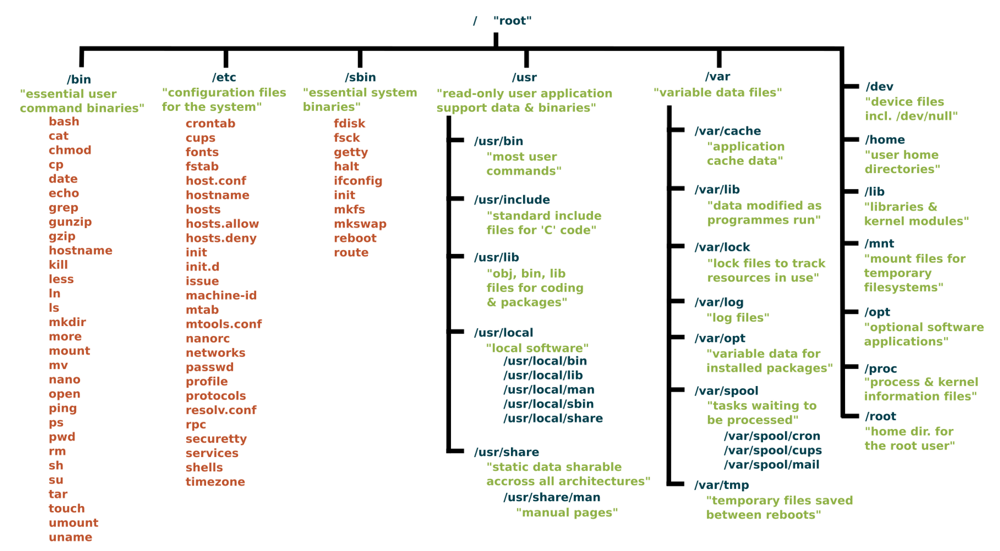
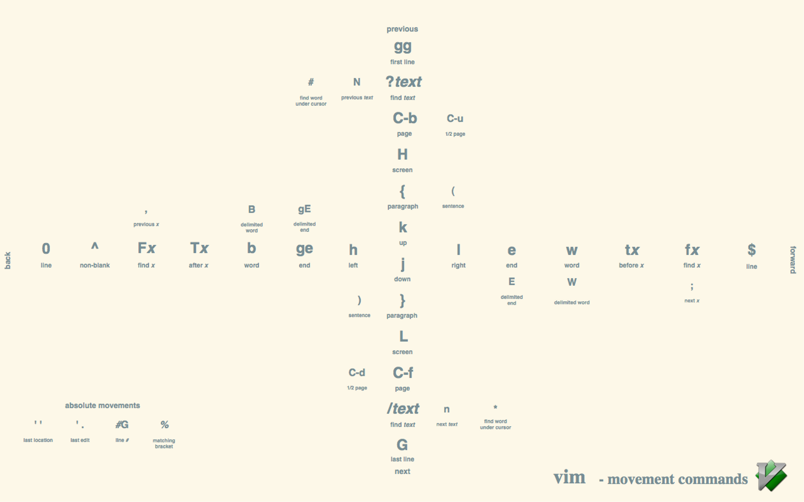

# Week 3

## Learning Outcomes and Topics

This week:

- Filesystem Hierarchy Standard
- Describe how most Linux directories are structured
- Use `lsblk` and `tree` to learn more about filesystems
- Use vi(m) to edit several files
- Introduction to `find` and `grep` to find files

Next week:

- Permissions and Ownership
- Users and Groups

## Utilities

Last week, we looked at a few utilities to help move around on the filesystem. This week we are going to look at tools to help learn more about the filesystem, tools to find files and tools to edit files. Most of these tools are already installed. The `tree` utility can be installed with the following command. `sudo apt install tree` In a later class, we will talk more about sudo and apt.
DigitalOcean note: When you are the root user you don’t need to use sudo.

## Filesystems

In general, when people talk about a filesystem they might be talking about 2 different, but very closely related things.

A file system or filesystem such as ext4 or btrfs is the underlying data structure used to separate and organize files on your system. There are a number of different types of filesystem, ext4 is a journalling filesystem, btrfs is a copy-on-write filesystem for example. Most of the time, a person using a computer doesn’t need to worry about which filesystem their machine is using (often more than one). 

The command `lsblk --exclude 7 -f` can be used to see how partitions on your Linux machine are formatted, which filesystem they use.

When you are installing a Linux OS, unless you have a good reason to change the filesystem, I recommend installing what the developers have setup as the default.

Resources:

[File systems](https://wiki.archlinux.org/title/File_systems)

[Btrfs](https://wiki.archlinux.org/title/Btrfs)

[Ext4](https://wiki.archlinux.org/title/Ext4)

## Filesystem Hierarchy Standard

The Filesystem Hierarchy Standard, or FHS is a good starting place, although not strictly adhered to. Different Linux distros will differ slightly in where certain things are stored.

[Filesystem Hierarchy Standard](https://refspecs.linuxfoundation.org/FHS_3.0/fhs/index.html)
![[Pasted image 20230125084250.png]]

Are there any directories that contain the same content? 
Why do you think that is?

As we progress through the class you will have more opportunity to explore some of these directories.

When I was learning to use Linux I would cd into a directory and try to find out what some the things inside that directory did.
Don't worry about breaking things, it is just a VM, and most "important" stuff you can't change without sudo.

There’s a man page for this too 😯 `man hier`

The `tree` utility is a little like `ls`,only it shows youthe contents of a directory, as well as subdirectories in a tree. Tree is great for exploring how files are organized.

The `tree` command will print a lot material.

We can narrow down the output with the `-d` and `-L` options. Try this `tree -dL 1`

You can also combine `tree` with `less` and a pipe, like this `tree -dL 2 | less`.

Note on terms:

- I sometimes use command, when I am talking about using a utility, running a command.
- And a utility when I am refering to the program itself.

**Pseudo Filesystems**

Last week I said “In Linux, everything is a file”. An interesting example of this is the `/proc` directory.

The `/proc` directory contains processes and kernel information files.
`/proc` makes use of the virtual file system to allow a user to interact with this data in the same way that you would what we more traditionally think of as a file. For example you can cat the uptime file to see how long your system has been up. 

## Finding Files with `grep` and `find`

`grep` and `find` are utilities that you will use a lot, you have already seen `grep` used to help narrow down the number of items returned when searching for a man page with `man`

Both `grep` and `find` can be used to help you; find files. `grep` searches the content of files, what is in the files and `find` searches for files by name, type, size…

[Red Hat 10 ways to use the Linux find command](https://learning.oreilly.com/library/view/learning-modern-linux/9781098108939/ch04.html)

[Red Hat How to use grep](https://www.redhat.com/sysadmin/how-to-use-grep)

## Command Linux Text Editors

Last week, we talked about a couple of reasons that we are still using the command line. Two of those reasons were: Servers don’t need a GUI and the fact that the command line can be really powerful and fast. Command line editors are an extension of both of these.

Sometimes you need to make small edits to a file on a server. You could edit the file locally, copy it to the server, delete the original… You can already see that this won’t always be the most efficient way to work. If you just need to change a line of text, open the file in a command line editor and edit the file.

Some of the things we talked about last week in terms of power and speed are relative, too. Many of the tools that we use on the command line are so great, because they are small, simple tools that can be combined to perform more complex tasks. A text editor is no different. 

## Why Vim

Why should you learn vi and Vim:

1. Vim is everywhere, from servers to key bindings in most other editors.
2. It's scalable. You can use it just to edit config files or it can become your entire writing and coding platform.
3. It's powerful.

Number 1 is the reason that we are interested in vi(m) today. vi really is everywhere, so it is a good idea to know the basics.

### vi, Vim and Neovim

[Vim](https://www.vim.org/)

[Neovim](https://neovim.io/)

### Modal Editing

What is a modal text editor?

The short answer is that it is an editor with different modes 🤔

Each mode has a specific purpose. That is to say, you would switch to that mode to perform certain tasks. 

Why is normal/command mode the default?

How would you describe a modal text editor to someone new to vim?

**vi modes:**
  - **command** mode (this is normal mode in vim)
  - **insert** mode

**vim modes:**

  - **normal** mode (this is the mode that you start vim in by default) escape
    use normal mode for many edits, removing text, changing indentation...
  - **insert** mode (this is basically the only mode other poor vscode has (unless you have the vim
    plugin for vscode)) i
  - **visual** mode use visual mode to make visual selections v
    - visual line mode, select one line at a time shift + v
    - visual block mode, select in blocks ctrl + v

  - **replace** mode replace text. replace mode is like insert but will write over existing text
      with the new character R

  - **command** mode allows you to enter commands that start with a : as well as run shell
    commands `:! mkdir new_dir` will create a new directory in your current working directory
    command mode can also be used for things like search and replace  

Just the basics

What other tool have we used in class with some of the same keybindings?

Provide an example of a keybinding that both tools share?

Vim commands

| Vim Command | Description |
| --- | --- |
| i | Enter Insert mode |
| Esc | Return to Normal mode from other modes  |
| x or Del | Delete a character |
| X | Delete character is backspace mode |
| u | Undo changes |
| Ctrl + r | Redo changes |
| yy | Copy a line |
| dd | Delete a line |
| p | Paste the content of the buffer |
| /<search_term> | Search and then cycle through matches with n and N |
| [[ or gg | Move to the beginning of a file |
| ]] or G | Move to the end of a file |
| :%s/foo/bar/gci | Search and replace all occurrences with confirmation |
| Esc + :w | Save changes |
| Esc + :wq or Esc + ZZ | Save and quit Vim |
| Esc + :q! | Force quit Vim discarding all changes |

## Getting help

Yes, there is a man page for vim `man vim` however vim also has builtin help.
You can access vim's builtin help with `:help`

You can access a specific section in the docs with `:help topic` ie `:help yank` will open documentation on copying in vim.

`:help` will open a split window above your current window. This is just another buffer so you can navigate through it with vim keys you can close it with `:bd` buffer delete.
You can move to a different split with Ctrl+w Arrow-keys for example `ctrl + w down-arrow` will take you to a split below the split you are currently in.

## Movements

How would you move to the top of a document?
How about to the bottom of a document?

One of the promises of Vim is that if you put in the time to learn Vim, you will be able to edit code faster.
I believe this is true (I also don't think you need to use Vim to be a good software developer)
One of the ways that Vim will speed up your workflow is a combination of editing commands and movements.

You already know that `h = left, l = right, j = down and k = up`

But this is just the beginning.

Some of these movements can also be combined with numbers. For example what do you think `2j` will do?

A more extensive Vim cheat sheet

[Vim Cheat Sheet](https://vim.rtorr.com/)

![[vimmove.png]]

## vim commands are composable

Can you think of a more complex example than 2j? What does it do?

Believe it or not, this simple little `2j` example is an incredibly powerful feature of vim.

Commands in Vim are composable. They form a simple language, and you can combine commands to make more complex commands. Vim commands are a programming interface 🤯

`4dd` and `4dj` will delete the current line and the following 3 lines.

### Verbs

Verbs are the actions we take, and they can be performed on nouns. Here are some examples:

- **`d`**: delete
- **`c`**: change
- **`y`**: yank (copy)
- **`v`**: visually select

### Modifiers

Modifiers are used before nouns to describe the way in which you're going to do something. Some examples:

- **`i`**: inside
- **`a`**: around
- **`NUM`**: number (e.g.: 1, 2, 10)
- **`t`**: searches for something and stops before it
- **`f`**: searches for that thing and lands on it
- **`/`**: find a string (literal or regex)

### Nouns

In English, nouns are objects you do something *to*. With Vim, it's the same. Here are some Vim nouns:

- **`w`**: word
- **`s`**: sentence
- **`)`**: sentence (another way of doing it)
- **`p`**: paragraph
- **`}`**: paragraph (another way of doing it)
- **`t`**: tag (think HTML/XML)
- **`b`**: block (think programming)

From [https://danielmiessler.com/study/vim/#files](https://danielmiessler.com/study/vim/#files)

## finding text

Which key would you use to find the character on a line before another character?

To search for a word in your file, use `/` forward or `?` backward

to move to the next occurrence of a character, use `f` for find ie `fa` will move to the next “a” on a line (if there is an a)

There is also a `:find` command, this is used to find files for editing by their name.

### Some other modal text editors

- **[Helix](https://helix-editor.com/)** This is the editor that I use in class.
- **[Kakoune](http://kakoune.org/)**

## Reading

[Learning Modern Linux, Ch 4, Access Control](https://learning.oreilly.com/library/view/learning-modern-linux/9781098108939/ch04.html)